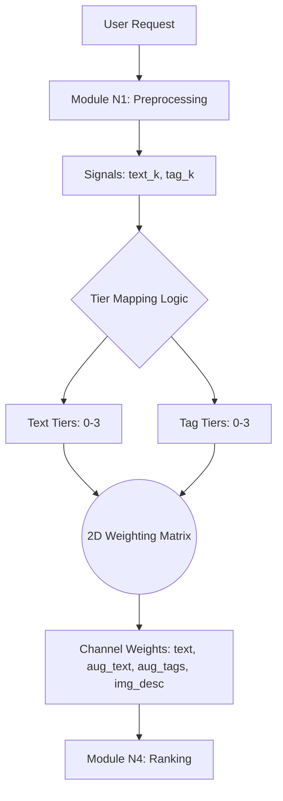

# Hệ Thống Trọng Số Động (Dynamic Weighting System)

**Dự án:** Travel Experience Planner  
**Ngày:** 2026-05-14  

---

## 0. Mô hình Ra quyết định (Decision Model)

Hệ thống sử dụng một "bộ điều tiết" (Regulator) để chuyển đổi các tín hiệu định lượng từ input thành các trọng số định tính:

---

## 1. Tổng Quan

Để xếp hạng địa điểm (N4) và hoạt động (N6) một cách chính xác, hệ thống không sử dụng một trọng số cố định. Thay vào đó, chúng ta sử dụng cơ chế **Trọng số Động (Dynamic Weighting)** dựa trên độ phong phú của dữ liệu đầu vào từ người dùng.

Hệ thống tính toán điểm số dựa trên 4 kênh vector (channels):

| Kênh | Đại diện cho | Vai trò |
|------|-------------|---------|
| `text` | Input thô của người dùng | Khớp ý định trực diện, độ chính xác cao (literal intent). |
| `aug_text` | Văn bản được mở rộng ngữ nghĩa | Diễn giải ngữ cảnh và cảm xúc (contextual interpretation). |
| `aug_tags` | Chuỗi thẻ (tags) được mở rộng | Điểm tựa ngữ nghĩa ổn định (stable semantic anchor). |
| `img_desc` | Mô tả hình ảnh (từ N2) | Khớp nối về mặt thị giác (visual alignment). |

---

## 2. Tín Hiệu Đầu Vào (Signals)

Hệ thống sử dụng hai chỉ số đếm (counts) được trích xuất từ giai đoạn tiền xử lý (N1):

1.  **text_k**: Số lượng từ khóa được phát hiện trong văn bản người dùng nhập.
2.  **tag_k**: Số lượng thẻ (tags) được người dùng chọn hoặc được suy luận.

Dựa trên các chỉ số này, hệ thống phân loại đầu vào thành các **Tiers (Cấp độ)** từ 0 đến 3.

### Phân cấp Văn bản (Text Tiers)
- **Tier 0 (text_k = 0):** Không có từ khóa; kênh `aug_text` sẽ bị tắt.
- **Tier 1 (text_k = 1-2):** Từ khóa thưa thớt; kênh `aug_text` được đẩy lên mạnh nhất để "bù đắp" thiếu hụt thông tin.
- **Tier 2 (text_k = 3-4):** Từ khóa trung bình; kênh `text` bắt đầu lấy lại trọng số.
- **Tier 3 (text_k = 5+):** Từ khóa phong phú; hệ thống ưu tiên ý định trực tiếp từ `text`, giảm thiểu sự phụ thuộc vào `aug_text`.

### Phân cấp Thẻ (Tag Tiers)
- **Tier 0 (tag_k = 0):** Không có thẻ; kênh `aug_tags` bị tắt.
- **Tier 1 (tag_k = 1-4):** Số lượng thẻ ít.
- **Tier 2 (tag_k = 5-8):** Số lượng thẻ đầy đủ.
- **Tier 3 (tag_k = 9+):** Số lượng thẻ phong phú.

---

## 3. Ma Trận Trọng Số 2D (2D Weighting Matrix)

Trọng số được quyết định bởi sự giao thoa giữa Text Tier và Tag Tier. 

**Ký hiệu:** `text` / `aug_text` / `aug_tags` / `img_desc`

| Text \ Tag | Tier 0 (Không tags) | Tier 1 (Ít tags) | Tier 2 (Đầy đủ) | Tier 3 (Nhiều tags) |
| :--- | :--- | :--- | :--- | :--- |
| **Tier 0 (Không text)** | 1.00 / 0.00 / 0.00 / 0.20 | 0.40 / 0.00 / 0.60 / 0.20 | 0.30 / 0.00 / 0.70 / 0.20 | 0.25 / 0.00 / 0.75 / 0.20 |
| **Tier 1 (Đỉnh điểm Aug)** | 0.20 / 0.80 / 0.00 / 0.20 | 0.10 / 0.60 / 0.30 / 0.20 | 0.10 / 0.50 / 0.40 / 0.20 | 0.10 / 0.40 / 0.50 / 0.20 |
| **Tier 2 (Cân bằng)** | 0.70 / 0.30 / 0.00 / 0.20 | 0.50 / 0.20 / 0.30 / 0.20 | 0.45 / 0.15 / 0.40 / 0.20 | 0.40 / 0.15 / 0.45 / 0.20 |
| **Tier 3 (Ưu tiên Text)** | 0.90 / 0.10 / 0.00 / 0.20 | 0.65 / 0.05 / 0.30 / 0.20 | 0.60 / 0.05 / 0.35 / 0.20 | 0.55 / 0.05 / 0.40 / 0.20 |

---

## 4. Tại sao cần Trọng số Động?

1.  **Xử lý truy vấn cực ngắn:** Khi người dùng chỉ nhập "đi biển", kênh `text` thô không đủ để tìm kiếm hiệu quả. Hệ thống sẽ kích hoạt Tier 1, đẩy trọng số `aug_text` lên 0.8 để sử dụng các diễn giải mở rộng (như "nghỉ dưỡng", "hải sản", "nắng vàng").
2.  **Ưu tiên Thẻ khi thông tin rõ ràng:** Khi người dùng chọn nhiều tags cụ thể, chúng ta coi đó là tín hiệu ổn định nhất và đẩy trọng số `aug_tags` lên cao (đạt 0.75 ở Tier 3).
3.  **Visual Search hỗ trợ:** Kênh `img_desc` luôn giữ một trọng số ổn định (~0.20) để đảm bảo kết quả luôn có sự tương đồng về mặt thị giác nếu người dùng có tải lên hình ảnh.
4.  **Tránh nhiễu (Noise Reduction):** Khi người dùng viết một đoạn văn rất dài (Tier 3), việc mở rộng thêm ngữ nghĩa (`aug_text`) có thể gây nhiễu. Do đó, hệ thống sẽ giảm trọng số này xuống mức tối thiểu (0.05).
