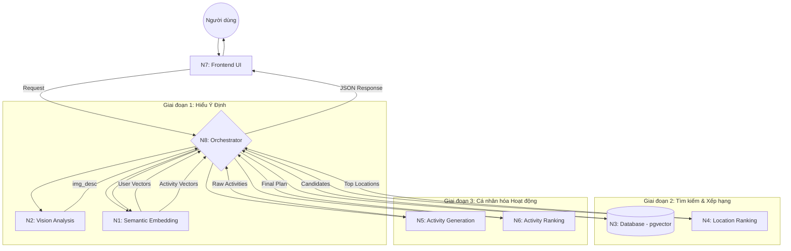

# Tổng Quan Kiến Trúc Hệ Thống (System Overview)

**Dự án:** Travel Experience Planner  
**Phiên bản:** 1.0 (Modular Architecture)  
**Ngày:** 2026-05-14  

---

## 1. Triết lý Thiết kế

Hệ thống được xây dựng theo kiến trúc **Modular Micro-services**, nơi mỗi module (từ N1 đến N7) đảm nhận một nhiệm vụ chuyên biệt và cô lập hoàn toàn. Trung tâm của toàn bộ hệ thống là **N8 Orchestrator**, đóng vai trò là "nhà điều phối" mọi luồng dữ liệu.

### Mục tiêu chính:
-   **Tính Linh hoạt & Module hóa (Modularity):** Thiết kế cho phép độc lập nâng cấp hoặc thay thế bất kỳ thành phần nào (từ model AI, cơ sở dữ liệu đến logic xếp hạng) mà không làm gián đoạn luồng vận hành của toàn hệ thống.
-   **Khả năng Chống chịu & Độ tin cậy (Resilience):** Tích hợp các cơ chế failover đa lớp, tự động sửa lỗi dữ liệu (Auto-repair) và điều tiết lưu lượng (Throttling) để đảm bảo hệ thống luôn phản hồi ổn định trong mọi tình huống.
-   **Tối ưu hóa Trải nghiệm Ngữ nghĩa (Semantic Excellence):** Tận dụng tối đa sức mạnh của vector embedding 1024 chiều và hệ thống trọng số động để xóa bỏ rào cản giữa ngôn ngữ tự nhiên của người dùng và dữ liệu máy móc.

---

## 2. Sơ đồ Luồng Dữ liệu End-to-End

Dưới đây là hành trình của một yêu cầu từ khi người dùng nhập thông tin đến khi nhận được gợi ý cuối cùng:

---

## 3. Các Thành phần Hệ thống (Module Breakdown)

### N1: Embedding (Trái tim ngữ nghĩa)
Sử dụng model **BGE-M3** để chuyển đổi mọi thứ thành vector. Đây là lớp nền tảng giúp hệ thống "hiểu" được văn bản và hình ảnh ở cấp độ toán học.

### N2: Vision (Đôi mắt AI)
Phân tích hình ảnh người dùng tải lên thông qua **Groq Vision**, chuyển đổi cảm xúc thị giác thành mô tả văn bản súc tích (50 từ).

### N3: Database Layer (Tầng lưu trữ)
Sử dụng **PostgreSQL** với extension `pgvector`. Đây là **Single Source of Truth** lưu trữ toàn bộ: Vectors, Metadata và **Binary Images** (`BYTEA[]`). Hệ thống hỗ trợ "Smart Fingerprinting" để tối ưu hóa việc đồng bộ hóa dữ liệu với Orchestrator.

### N4: Location Ranking (Bộ lọc thông minh)
Áp dụng **Trọng số Động (Dynamic Weighting)** để ưu tiên các kênh thông tin khác nhau (text vs tags) tùy thuộc vào độ chi tiết của yêu cầu.

### N5: Activity Generation (Sáng tạo nội dung)
Sử dụng **LLM Chain** với 7 tầng dự phòng để sinh ra các hoạt động du lịch độc đáo, không trùng lặp cho từng địa điểm.

### N6: Activity Ranking (Tinh chỉnh cá nhân)
Xếp hạng hoạt động theo mô hình **Hybrid 50/50** (Ngữ nghĩa + Thuộc tính thể lực/xã hội) để đảm bảo hoạt động thực sự khớp với phong cách người dùng.

### N7: UI/Frontend (Trải nghiệm người dùng)
Xây dựng bằng **Streamlit**, tích hợp cơ chế **State Caching (Session & Snapshots)** để bảo toàn dữ liệu người dùng khi chuyển đổi giữa các phương thức nhập liệu mà không cần tải lại trang.

### N8: Orchestrator (Nhà điều phối)
Lớp API điều phối toàn bộ quy trình. Tích hợp **Distributed Hybrid Caching**:
-   **Smart Fingerprint Check:** Kiểm tra phiên bản dữ liệu từ N3 trong miliseconds trước mỗi yêu cầu.
-   **Local Image Persistence:** Tự quản lý và cache hình ảnh thành file cục bộ, mô phỏng một dịch vụ độc lập không phụ thuộc vào hệ thống file của Database.

---

## 4. Các Công nghệ then chốt

| Công nghệ | Vai trò | Ưu điểm cốt lõi |
|-----------|---------|-----------------|
| **Groq LPU** | Inference Engine | Tốc độ xử lý LLM cực nhanh (~500 tok/s). |
| **BGE-M3** | Embedding Model | Đa ngôn ngữ, độ chính xác cao nhất cho Tiếng Việt. |
| **pgvector** | Vector DB | Tích hợp sâu vào SQL, hiệu suất ổn định. |
| **Modular Logic** | Architecture | Dễ bảo trì, dễ debug từng phần riêng biệt. |

---

## 5. Kết luận

Hệ thống Travel Experience Planner không chỉ là một ứng dụng wrapper cho AI, mà là một **Pipeline xử lý dữ liệu thông minh**. Bằng cách tách biệt phần "Hiểu" (N1, N2), phần "Tìm" (N3, N4) và phần "Sáng tạo" (N5, N6), chúng ta tạo ra một giải pháp du lịch cá nhân hóa mạnh mẽ, bền bỉ và sẵn sàng cho quy mô production.
