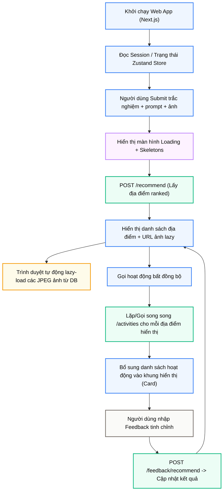

# Module N16: Giao diện Next.js Web App

**Dự án:** Travel Experience Planner  
**Ngày:** 2026-05-19

---

## 1. Vai trò của Module N16

N16 là lớp tiếp xúc trực tiếp với người dùng. Với việc nâng cấp hệ thống từ Streamlit (dạng script-rerun tuần tự) sang **Next.js Web App** (Client-Server bất đồng bộ, React 19 + Next.js 15 App Router), N16 mang lại khả năng tương tác vượt trội, phản hồi thời gian thực và trải nghiệm mượt mà xứng tầm một ứng dụng thương mại cao cấp.

Trong bài toán gợi ý du lịch, Next.js Web App giải quyết triệt để 3 bài toán lớn:
- **Tương tác bất đồng bộ (Non-blocking UI):** Khắc phục hoàn toàn hiện tượng lag/đơ giao diện khi chờ API hoặc tải hình ảnh nhị phân dung lượng lớn.
- **Trạng thái phiên linh hoạt (Dynamic Session Management):** Lưu trữ thông tin đăng nhập, token bảo mật, và lịch sử khuyến nghị của người dùng xuyên suốt các trang.
- **Đa dạng hóa chế độ xem (Multi-mode Experience):** Cung cấp đồng thời chế độ Khám phá địa điểm (Explore Grid) và chế độ Lập kế hoạch chi tiết (Planner Page).

---

## 2. Tư duy Kiến trúc và Stack Công nghệ

N16 được thiết kế theo mô hình Single Page Application (SPA) kết hợp Server-Side Rendering (SSR) tối ưu của Next.js:

- **Khung ứng dụng:** Next.js 15 (React 19) sử dụng **App Router** (`src/app`) để phân chia routes rõ ràng, tối ưu hóa bundle size và tốc độ tải trang ban đầu.
- **Quản lý trạng thái:** **Zustand** (`src/store/planner-store.ts`) đóng vai trò quản lý state tập trung cho toàn bộ luồng nhập trắc nghiệm (Wizard Slider), kết quả gợi ý địa điểm, và danh sách hoạt động.
- **Thiết kế giao diện:** **Tailwind CSS** kết hợp thư viện thành phần **shadcn/ui** mang lại giao diện tối giản, hiện đại, hỗ trợ hiệu ứng kính mờ (Glassmorphism), Dark Mode cao cấp và chuyển động mượt mà.
- **Tương tác API:** Kết nối Flask Orchestrator (N8) thông qua các Fetch API Client bất đồng bộ kèm cơ chế xử lý lỗi/loading skeletons chuyên nghiệp.

---

## 3. Cấu trúc thư mục của ứng dụng web

Hạ tầng Next.js được tổ chức mô-đun hóa cao độ tại thư mục `frontend/web/src`:

- `app/`: Định nghĩa các Router chính của ứng dụng:
  - `(planner)/`: Luồng lập kế hoạch chính: `page.tsx` (Form/Wizard nhập liệu) và `results/page.tsx` (Bảng hiển thị kết quả và feedback).
  - `explore/`: Trang khám phá toàn bộ địa điểm có sẵn trong cơ sở dữ liệu (`explore_locations_service`).
  - `profile/`: Trang quản lý tài khoản người dùng, bao gồm Đăng ký/Đăng nhập và danh sách lịch sử gợi ý (`rec_history`).
  - `api/`: Các endpoint trung gian (API Routes) phục vụ bảo mật hoặc proxy.
- `components/`: Các React Components tái sử dụng (Bản đồ, Cards địa điểm, Activity Drawers, Skeletons loader).
- `store/planner-store.ts`: Zustand Store duy trì trạng thái ứng dụng, tránh thất thoát dữ liệu khi chuyển trang.

---

## 4. Các phương thức nhập liệu & Wizard Slider

N16 hỗ trợ một Form nhập liệu dạng Wizard trượt cực kỳ ấn tượng, chia làm 3 kênh thu thập ý định của người dùng:
1.  **Trắc nghiệm sở thích (Wizard Questionnaire):** Thu thập các preferences có cấu trúc (thời gian đi, ngân sách, phong cách du lịch ưa thích) thông qua các thẻ chọn đẹp mắt.
2.  **Mô tả tự nhiên (Free-text Prompt):** Ô nhập văn bản hỗ trợ NLP giúp người dùng mô tả nhu cầu một cách chi tiết bằng ngôn ngữ tự nhiên.
3.  **Tải ảnh cảm hứng (Visual Image Upload):** Cho phép tải lên hình ảnh đại diện cho không khí (vibe) chuyến đi muốn tìm kiếm (N2 phân tích mô tả ảnh).

---

## 5. Chiến lược tối ưu hóa Hiệu năng & Trải nghiệm Người dùng (UX)

Sự kết hợp giữa Next.js và kiến trúc API mới của N8 mang lại hiệu năng vượt trội nhờ hai chiến lược cốt lõi:

### 5.1. Tải ảnh Lazy Loading cực hạn (Asynchronous Lazy Image Loading)
Hệ thống loại bỏ hoàn toàn việc truyền tải ảnh Base64 nhị phân nặng nề trong API trả về của `/recommend`.
- API `/recommend` chỉ trả về thông tin địa điểm (slim metadata) kèm danh sách URL ảnh dạng: `/api/images/{location_id}_{idx}.jpg`.
- Frontend nhận JSON phản hồi siêu nhẹ, render cấu trúc thẻ (Card) địa điểm ngay lập tức.
- Trình duyệt tự động kích hoạt lazy load tải các ảnh song song, độc lập khi thẻ đó xuất hiện trên khung hình (viewport). `/api/images` sẽ truy vấn trực tiếp cơ sở dữ liệu Postgres để lấy nhị phân ảnh thô.

### 5.2. Luồng gọi API bất đồng bộ theo từng tầng (Progressive Rendering)
Giao diện không bắt người dùng chờ đợi cả hai quá trình tìm địa điểm và sinh hoạt động hoàn tất:

---

## 6. Vòng phản hồi hai cấp tại UI (Interactive Feedback Loop)

Web App hiển thị các khung nhập phản hồi trực tiếp giúp người dùng tương tác tự nhiên:
- **Phản hồi toàn cục (Global Feedback):** Khung chat chính nằm bên cạnh danh sách gợi ý. Khi gửi, hệ thống gọi `/feedback/recommend` để tinh chỉnh lại toàn bộ danh sách địa điểm phù hợp hơn.
- **Phản hồi địa điểm (Local Activity Feedback):** Nút tinh chỉnh hoạt động ngay trong Drawer/Modal của từng địa điểm. Người dùng có thể yêu cầu thay đổi (ví dụ: "thêm hoạt động trong nhà", "bớt đi bộ leo núi") thông qua `/feedback/activities` để sinh lại tập hoạt động của riêng nơi đó.

---

## 7. Chế độ Khám phá (Explore Grid) và Quản lý Lịch sử (User Profiles)

- **Trang Khám phá (`/explore`):** Gọi endpoint `/locations` siêu nhẹ của N8 để lấy toàn bộ địa điểm. Next.js hiển thị dưới dạng lưới (Grid) thẻ ảnh tương tác. Người dùng nhấp vào địa điểm để xem nhanh mô tả mà không cần thực hiện luồng trắc nghiệm.
- **Trang Cá nhân & Auth (`/profile`):** Tích hợp đầy đủ các form Đăng ký / Đăng nhập. Sau khi xác thực thành công, Next.js truy xuất lịch sử gợi ý (`/api/profile/history/{user_id}`) và hiển thị dạng danh sách các chuyến đi cũ. Người dùng có thể nhấp vào một chuyến đi cũ để nạp lại toàn bộ kết quả lên giao diện lập kế hoạch ngay lập tức.

---

## 8. Kết luận

Việc chuyển đổi N16 sang **Next.js Web App** đã biến dự án từ một bản thử nghiệm dòng lệnh/notebook thành một sản phẩm Web ứng dụng thực thụ. Thiết kế bất đồng bộ, phân rã ảnh lazy loading, quản lý state tập trung bằng Zustand và giao diện Tailwind tinh tế là những điểm nhấn kiến trúc đắt giá, giúp hệ thống hoạt động ổn định, đạt hiệu năng tải trang tối đa và mang lại trải nghiệm người dùng hoàn hảo.

---

## 9. Tài liệu tham khảo

| # | Chủ đề | Nguồn tham khảo |
|---|---|---|
| 1 | Next.js 15 App Router | [nextjs.org/docs](https://nextjs.org/docs) |
| 2 | React 19 Features | [react.dev](https://react.dev/) |
| 3 | Zustand State Management | [github.com/pmndrs/zustand](https://github.com/pmndrs/zustand) |
| 4 | Tailwind CSS & shadcn/ui | [tailwindcss.com](https://tailwindcss.com/) / [ui.shadcn.com](https://ui.shadcn.com/) |
