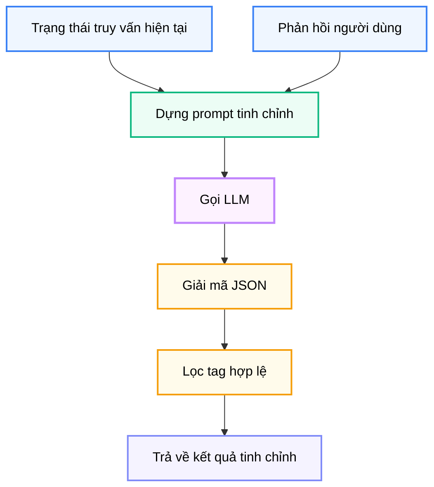

# Module N17: Xử lý Phản hồi

**Dự án:** Travel Experience Planner  
**Ngày:** 2026-05-15

---

## 1. Vai trò của Module N17

N17 là lớp giúp hệ thống không bị giới hạn ở mô hình “nhập một lần, trả kết quả một lần”. Module này cho phép người dùng đưa ra phản hồi sau khi đã nhìn thấy gợi ý ban đầu, từ đó tinh chỉnh lại toàn bộ truy vấn mà không phải bắt đầu lại từ con số không.

Về bản chất, N17 là cầu nối giữa:

- ý định ban đầu
- phản hồi mới phát sinh
- truy vấn tinh chỉnh để chạy lại pipeline

Điều này rất quan trọng trong recommendation thực tế, vì người dùng thường chỉ biết chính xác mình muốn gì sau khi thấy kết quả đầu tiên.

---

## 2. Tư tưởng thiết kế: Query Refinement thay vì Query Rewrite toàn phần

N17 không xem feedback như một truy vấn mới hoàn toàn. Thay vào đó, nó xem feedback là tín hiệu để **refine trạng thái truy vấn hiện tại**.

Điều này có ý nghĩa lớn:

- giữ lại phần ý định cũ vẫn còn đúng
- chỉ điều chỉnh phần người dùng chưa hài lòng
- làm trải nghiệm giống một vòng hội thoại tự nhiên hơn

Đây là lý do N17 nhận đồng thời:

- `user_input`
- `user_tags`
- `img_desc`
- `feedback_text`

thay vì chỉ nhận riêng mỗi câu feedback.

---

## 3. Giao diện công khai

```python
process_feedback(
    user_input: str,
    user_tags: list[str],
    img_desc: str,
    feedback_text: str,
    llm_chain: str | None = None,
) -> dict[str, Any]
```

### 3.1. Đầu ra

```python
{
    "refined_text": str,
    "refined_tags": list[str],
    "refined_img_desc": str,
    "explanation": str,
    "metadata": {
        "model": str | None,
        "provider": str | None,
        "usage": dict | None,
    },
}
```

Đây là một response rất tốt về mặt thiết kế vì nó không chỉ trả nội dung refine, mà còn trả luôn:

- lời giải thích để đưa lên UI
- metadata model để debug và benchmark

---

## 4. Cách module hoạt động



Các bước chính:

1. xây prompt từ input hiện tại và feedback mới
2. gọi model với yêu cầu trả JSON
3. parse object trả về
4. kiểm tra trường bắt buộc
5. lọc tags theo vocabulary chuẩn
6. trả refined payload

---

## 5. Prompt Engineering trong N17

Điểm quan trọng của N17 là không chỉ “hỏi LLM sửa câu query”. Prompt hiện tại buộc model phải xử lý có cấu trúc:

- cập nhật `refined_text`
- cập nhật `refined_tags`
- cập nhật `refined_img_desc`
- sinh `explanation` để giao tiếp với người dùng

### 5.1. Vì sao cần `explanation`?

Nếu hệ thống chỉ âm thầm thay query rồi chạy lại, người dùng khó hiểu điều gì đã thay đổi. Trường `explanation` biến N17 từ một bộ xử lý ngầm thành một lớp giao tiếp có tính minh bạch.

### 5.2. Vì sao phải giới hạn tags hợp lệ?

LLM có xu hướng bịa ra tag gần nghĩa nhưng không nằm trong vocabulary chuẩn. Nếu không lọc:

- các bước sau dễ nhận dữ liệu không nhất quán
- semantic pipeline mất ổn định
- báo cáo debug khó đọc

Do đó, N17 bắt buộc normalize và filter tags sau khi parse.

---

## 6. Xử lý hình ảnh trong vòng phản hồi

Một điểm thú vị là N17 không chỉ refine text và tags, mà còn xem xét cả `img_desc`.

Điều này rất quan trọng vì trong trải nghiệm thực tế, người dùng có thể nói:

- “bỏ qua ảnh”
- “ảnh cũ không đúng ý”
- “muốn đổi sang không khí khác”

Nếu hệ thống vẫn giữ nguyên `img_desc` cũ trong những trường hợp đó, toàn bộ pipeline semantic phía sau có thể tiếp tục bị bias sai hướng. Vì vậy, `refined_img_desc` là một phần hợp lý và cần thiết của thiết kế.

---

## 7. Cơ chế fallback

N17 không dừng toàn bộ vòng refine khi LLM lỗi. Thay vào đó, module trả một fallback payload:

- `refined_text`: nối query cũ và feedback
- `refined_tags`: giữ tags cũ
- `refined_img_desc`: giữ mô tả ảnh cũ
- `explanation`: báo rằng fallback đã được dùng

### 7.1. Vì sao fallback này có giá trị?

Về mặt UX, fallback tốt hơn nhiều so với lỗi cứng:

- người dùng vẫn có cảm giác hệ thống phản ứng
- vòng feedback không bị đứt
- có thể tiếp tục debug từ output hiện có

Đây là một lựa chọn resilience rất hợp lý.

---

## 8. Ghi chú vận hành

- module gọi trực tiếp endpoint Groq-compatible
- retry được thực hiện theo model chain cấu hình
- response kỳ vọng là JSON object thuần
- usage metadata được giữ lại để quan sát runtime cost

---

## 9. Kết luận

N17 là module giúp hệ thống recommendation có khả năng hội thoại và tự điều chỉnh. Giá trị lớn nhất của nó nằm ở việc biến feedback tự nhiên của người dùng thành một payload refine có cấu trúc, có thể chạy lại toàn bộ pipeline mà vẫn giữ được tính nhất quán dữ liệu.

Đây là phần mở rộng rất quan trọng nếu muốn hệ thống tiến gần từ “engine gợi ý một lần” sang “assistant có thể cùng người dùng tinh chỉnh kết quả”.
