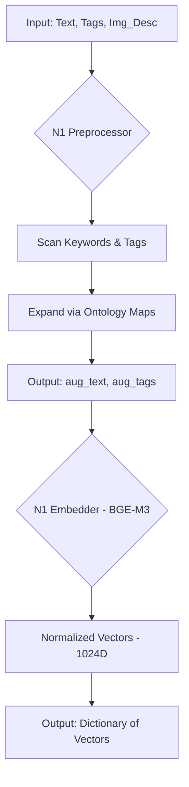

# Module N1: Tiền xử lý và Nhúng Vector (Embedding)

**Dự án:** Travel Experience Planner  
**Ngày:** 2026-05-14  

---

## 1. Vai trò của Module N1

Module N1 là "trái tim" của hệ thống tìm kiếm ngữ nghĩa. Mọi dữ liệu từ người dùng (văn bản, thẻ, hình ảnh) đều phải đi qua N1 để chuyển đổi từ dạng ngôn ngữ tự nhiên sang dạng **Vector (Toán học)**. Nếu N1 không hoạt động chính xác, toàn bộ quá trình xếp hạng phía sau (N4, N6) sẽ mất đi tính chính xác về mặt ngữ nghĩa.

---

## 2. Model BGE-M3: Động cơ chính của hệ thống

Chúng ta sử dụng model **BGE-M3 (BAAI General Embedding - Multi-lingual, Multi-function, Multi-granularity)**. Đây là một trong những model embedding mạnh mẽ nhất hiện nay cho các tác vụ retrieval.

### Tại sao BGE-M3 lại quan trọng?
1.  **Đa ngôn ngữ (Multi-lingual):** Hỗ trợ hơn 100 ngôn ngữ, cực kỳ hiệu quả với Tiếng Việt và Tiếng Anh (hai ngôn ngữ chính của dự án).
2.  **Đa chức năng (Multi-function):** Hỗ trợ cả Dense Retrieval (vector dày), Sparse Retrieval (như BM25), và Multi-vector Reranking. Dự án của chúng ta hiện đang tận dụng thế mạnh **Dense Retrieval**.
3.  **Kích thước Vector:** Trả về vector 1024 chiều, cung cấp đủ không gian để biểu diễn các sắc thái tinh tế của địa điểm và sở thích người dùng.
4.  **Độ dài ngữ cảnh:** Hỗ trợ lên đến 8192 tokens, cho phép xử lý các đoạn mô tả địa điểm rất dài mà không bị mất thông tin.

---

## 3. Cơ chế Mở rộng Dữ liệu (Augmentation)

Một trong những cải tiến quan trọng nhất trong N1 là giai đoạn **Augmentation**. Chúng ta không chỉ nhúng (embed) văn bản thô, mà còn làm giàu nó trước khi đưa vào model.

### Tại sao cần Augmentation?
Người dùng thường nhập các truy vấn rất ngắn như "đi biển". Nếu chỉ nhúng từ này, vector sẽ rất nghèo nàn thông tin. Augmentation giúp "giải nén" ý định của người dùng.

### Quy trình hoạt động:
1.  **Emotion & Context Scan:** N1 quét văn bản thô để tìm các từ khóa cảm xúc (ví dụ: "vui vẻ", "yên bình") và ngữ cảnh (ví dụ: "gia đình", "cặp đôi").
2.  **Tag Expansion:** Mỗi tag người dùng chọn sẽ được mở rộng dựa trên **Ontology** (Ví dụ: `trekking` → `multi-day trekking mountain trail jungle endurance rewarding`).
3.  **Deduplication:** Loại bỏ các phần trùng lặp để tránh làm nhiễu vector.
4.  **Channel Synthesis:** Tạo ra các chuỗi văn bản mới (`aug_text`, `aug_tags`) để mang đi nhúng.

**Kết quả:** Một truy vấn ngắn được biến thành một đoạn văn bản giàu thông tin, giúp BGE-M3 tạo ra một vector "đậm đặc" và chính xác hơn.

---

## 4. Tín hiệu text_k, tags_k và Trọng số động

N1 không chỉ trả về vector, mà còn trả về các "tín hiệu chất lượng" để điều khiển hệ thống trọng số động ở các bước sau.

-   **text_k**: Số lượng từ khóa cảm xúc/ngữ cảnh tìm thấy trong text.
-   **tags_k**: Số lượng tags hợp lệ tìm thấy.

### Tầm quan trọng đối với Dynamic Weighting:
Hệ thống sử dụng `text_k` và `tags_k` để quyết định mức độ "tin tưởng" vào từng kênh:
-   Nếu `text_k` thấp (người dùng viết ngắn), hệ thống sẽ tin vào **`aug_text`** (phần đã được N1 mở rộng) hơn.
-   Nếu `tags_k` cao (người dùng chọn nhiều tags), hệ thống sẽ tin vào kênh **`aug_tags`** vì đây là tín hiệu có cấu trúc ổn định nhất.

---

## 5. Luồng xử lý độc lập

---

## 6. Giao diện (Interface)

Module N1 hoạt động như một dịch vụ nhúng (embedding service) thuần túy:
-   **Input:** Nhận văn bản thô, danh sách thẻ (tags), và mô tả hình ảnh.
-   **Process:** Tiền xử lý, mở rộng ngữ nghĩa và thực hiện nhúng vector.
-   **Output:** Trả về một dictionary chứa các vector 1024 chiều đã được chuẩn hóa (normalized) và các tín hiệu chất lượng (`text_k`, `tags_k`).

---

## 7. Tài liệu tham khảo

| # | Chủ đề | Nguồn tham khảo |
|---|---|---|
| 1 | BGE-M3 Paper — Multi-lingual, Multi-function, Multi-granularity | [arxiv.org/abs/2402.03216](https://arxiv.org/abs/2402.03216) |
| 2 | BGE-M3 GitHub — FlagOpen/FlagEmbedding | [github.com/FlagOpen/FlagEmbedding](https://github.com/FlagOpen/FlagEmbedding) |
| 3 | BAAI/bge-m3 Model Card | [huggingface.co/BAAI/bge-m3](https://huggingface.co/BAAI/bge-m3) |
| 4 | Sentence-Transformers Documentation | [www.sbert.net](https://www.sbert.net/) |
| 5 | Pinecone — Vector similarity: cosine vs dot product | [pinecone.io/learn/vector-similarity](https://www.pinecone.io/learn/vector-similarity/) |
| 6 | Hệ thống Thẻ (Tagging System) | [docs/tagging_system.md](tagging_system.md) |
