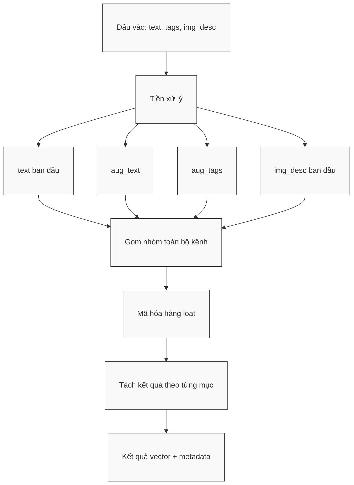

# Module N1: Nhúng Vector và Tiền xử lý Ngữ nghĩa

**Dự án:** Travel Experience Planner  
**Ngày:** 2026-05-15

---

## 1. Vai trò của Module N1

N1 là lớp chuyển đổi tín hiệu đầu vào thành biểu diễn ngữ nghĩa có thể tính toán được. Nếu xem toàn bộ hệ thống như một pipeline ra quyết định, thì N1 chính là nơi biến các mô tả tự nhiên của người dùng hoặc dữ liệu địa điểm thành không gian vector 1024 chiều, nơi các thao tác so khớp, xếp hạng và suy luận phía sau có thể hoạt động một cách nhất quán.

Tuy nhiên, vai trò của N1 không dừng ở việc "gọi model embedding". Điểm giá trị thực sự của module này nằm ở ba tầng xử lý:

1. **Chuẩn hóa tín hiệu đầu vào:** tách và làm sạch các nguồn tín hiệu như `text`, `tags`, `img_desc`.
2. **Augmentation ngữ nghĩa:** mở rộng nội dung đầu vào để làm giàu tín hiệu trước khi nhúng.
3. **Xuất ra nhiều kênh vector độc lập:** giúp hệ thống phía sau có thể thực hiện **dynamic weighting** thay vì ép mọi thông tin vào một vector duy nhất.

Nói cách khác, N1 không chỉ "mã hóa", mà còn "tổ chức lại ý nghĩa" của đầu vào để phục vụ retrieval.

---

## 2. Lý do lựa chọn mô hình nhúng

N1 hiện sử dụng model `BAAI/bge-m3`, một embedding model mạnh cho các tác vụ semantic retrieval.

### 2.1. Vì sao chọn BGE-M3?

Lý do lựa chọn không chỉ vì đây là model phổ biến, mà vì nó phù hợp với đặc thù của bài toán:

- **Đa ngôn ngữ:** dữ liệu của hệ thống có thể trộn giữa tiếng Việt và tiếng Anh, đặc biệt trong tags, mô tả địa điểm và mô tả ảnh.
- **Biểu diễn retrieval mạnh:** BGE-M3 phù hợp với bài toán so khớp truy vấn ngắn với dữ liệu mô tả giàu ngữ nghĩa.
- **Không gian vector 1024 chiều:** đủ rộng để giữ các sắc thái như bối cảnh, cảm xúc, loại trải nghiệm và phong cách du lịch.
- **Tính ổn định tốt cho pipeline nhiều bước:** rất quan trọng khi vector từ N1 còn được sử dụng lặp lại ở nhiều bước sau, thay vì chỉ phục vụ một truy vấn đơn lẻ.

### 2.2. Ý nghĩa của việc chuẩn hóa vector

N1 sinh embedding với `normalize_embeddings=True`. Điều này mang lại hai lợi ích lớn:

- giảm sự phụ thuộc vào độ lớn tuyệt đối của vector
- làm cho cosine similarity trở thành thước đo ổn định và dễ diễn giải hơn

Với cách này, hệ thống phía sau có thể tập trung vào "hướng ngữ nghĩa" của vector thay vì bị ảnh hưởng bởi chuẩn độ dài của đầu ra model.

---

## 3. Giao diện công khai của module

N1 cung cấp hai hàm public:

```python
embed(data: dict[str, Any]) -> dict[str, Any]
embed_batch(data_list: list[dict[str, Any]]) -> list[dict[str, Any]]
```

Trong đó:

- `embed()` là wrapper cho trường hợp một phần tử duy nhất
- `embed_batch()` là đường xử lý tối ưu cho nhiều phần tử cùng lúc

### 3.1. Cấu trúc đầu vào

```python
{
    "text": str,
    "tags": list[str],
    "img_desc": str,
}
```

Ý nghĩa các trường:

- `text`: mô tả nhu cầu du lịch hoặc mô tả địa điểm
- `tags`: bộ nhãn sở thích hay thuộc tính ngữ nghĩa
- `img_desc`: mô tả hình ảnh ở dạng văn bản

### 3.2. Cấu trúc đầu ra

```python
{
    "text_k": int,
    "tags_k": int,
    "preprocessed": {
        "text": str,
        "aug_text": str,
        "aug_tags": str,
        "img_desc": str,
    },
    "vectors": {
        "text": list[float] | None,
        "aug_text": list[float] | None,
        "aug_tags": list[float] | None,
        "img_desc": list[float] | None,
    },
    "metadata": {
        "model": str,
        "device": str,
        "latency_ms": float,
    },
}
```

Đây là một cấu trúc đầu ra giàu thông tin, không chỉ chứa vector mà còn giữ:

- phiên bản văn bản sau khi tiền xử lý
- số lượng tín hiệu augmentation hữu ích
- metadata vận hành để debug và benchmark

---

## 4. Tư tưởng thiết kế: Multi-channel Embedding

Một quyết định thiết kế rất quan trọng trong N1 là **không nhúng mọi thứ vào một chuỗi duy nhất**. Thay vào đó, module giữ bốn kênh riêng biệt:

- `text`
- `aug_text`
- `aug_tags`
- `img_desc`

### 4.1. Vì sao không gộp tất cả thành một vector?

Nếu gộp hết thông tin thành một câu dài rồi nhúng một lần, hệ thống sẽ gặp ba vấn đề:

1. **Mất khả năng giải thích:** không biết tín hiệu đến từ text, tags hay ảnh.
2. **Mất khả năng điều tiết trọng số:** mọi tín hiệu bị "trộn" vào cùng một không gian.
3. **Giảm độ linh hoạt của ranking:** không thể ưu tiên tags khi tags mạnh, hoặc ưu tiên text khi text rõ.

Việc giữ nhiều kênh embedding riêng giúp pipeline sau đó áp dụng **dynamic weighting** một cách có kiểm soát. Đây là một quyết định kiến trúc quan trọng, không chỉ là chi tiết cài đặt.

---

## 5. Augmentation: Lõi tư duy ngữ nghĩa của N1

Một trong những điểm học thuật đáng giá nhất của module này là giai đoạn **augmentation**.

### 5.1. Augmentation là gì?

Augmentation trong N1 là quá trình làm giàu nội dung đầu vào trước khi nhúng, nhằm tăng mật độ ngữ nghĩa của vector đầu ra.

Thay vì nhúng nguyên văn một truy vấn ngắn như:

```text
đi biển
```

N1 cố gắng "giải nén" ý định ẩn sau truy vấn đó bằng cách thêm các tín hiệu liên quan:

- cảm xúc
- ngữ cảnh
- ontology của tags
- mô tả mở rộng cho hành vi du lịch

### 5.2. Vì sao augmentation cần thiết?

Trong bài toán recommendation du lịch, người dùng thường mô tả rất ngắn, nhưng kỳ vọng kết quả lại rất giàu sắc thái. Ví dụ:

- "đi biển"
- "yên tĩnh"
- "đi với gia đình"
- "muốn nơi chill"

Nếu nhúng trực tiếp các cụm ngắn như vậy, vector tạo ra thường:

- thiếu ngữ cảnh
- không đủ tín hiệu để tách biệt các loại trải nghiệm gần nhau
- khó hỗ trợ ranking ổn định ở những bước sau

Augmentation giải quyết đúng điểm yếu này bằng cách mở rộng tín hiệu trước khi đưa vào model.

### 5.3. Hai dạng augmentation chính

#### a. `aug_text`

`aug_text` được tạo từ:

- text gốc
- các expansion theo emotion
- các expansion theo context

Ví dụ, nếu text chứa ý "yên bình", "gia đình", "nghỉ dưỡng", module có thể biến truy vấn gốc thành một câu giàu nghĩa hơn, phản ánh rõ hơn loại trải nghiệm mong muốn.

#### b. `aug_tags`

`aug_tags` được tạo từ ontology của hệ thống tags.  
Ví dụ, một tag ngắn như `trekking` có thể được mở rộng thành cụm mô tả giàu thông tin hơn về địa hình, cường độ, bối cảnh và tính trải nghiệm.

Điều này đặc biệt quan trọng vì tags thường có tính biểu tượng cao nhưng quá ngắn nếu đem nhúng trực tiếp.

---

## 6. Hai tín hiệu trung gian `text_k` và `tags_k`

N1 không chỉ trả ra vector. Nó còn trả hai tín hiệu chất lượng cực kỳ quan trọng:

- `text_k`
- `tags_k`

### 6.1. `text_k` là gì?

`text_k` là số lượng tín hiệu augmentation phía text mà module thực sự tìm thấy và áp dụng được.

Nó cho biết:

- text đầu vào có giàu ngữ cảnh hay không
- augmentation phía text có đóng góp thực chất hay không

### 6.2. `tags_k` là gì?

`tags_k` là số lượng tag hợp lệ mà hệ thống nhận diện được và mở rộng thành công.

Nó phản ánh:

- chất lượng cấu trúc của phần tags
- mức độ đáng tin cậy của kênh tags trong so khớp ngữ nghĩa

### 6.3. Tại sao hai giá trị này quan trọng?

Đây chính là cầu nối trực tiếp từ N1 sang chiến lược **dynamic weighting** của toàn hệ thống.

Ví dụ:

- nếu `text_k` thấp, truy vấn text có thể nghèo tín hiệu, khi đó hệ thống nên tin vào `aug_text` nhiều hơn `text`
- nếu `tags_k` cao, nghĩa là người dùng đã cung cấp một bộ tags chất lượng, khi đó có thể tăng trọng số cho `aug_tags`

Như vậy, `text_k` và `tags_k` không phải metadata thừa, mà là tín hiệu điều khiển mức độ tin cậy giữa các kênh vector.

---

## 7. Luồng xử lý nội bộ



Các bước thực thi ở mức code:

1. preprocess từng phần tử đầu vào
2. tạo bốn chuỗi theo bốn kênh
3. flatten toàn bộ batch thành một danh sách chuỗi lớn
4. gọi `SentenceTransformer.encode()` đúng một lần
5. unflatten lại theo từng item
6. gắn metadata model, device và latency

---

## 8. Tối ưu hiệu năng: Batch-first Strategy

Thiết kế `embed_batch()` là một điểm tối ưu quan trọng.

### 8.1. Vì sao batch trước rồi mới encode?

Nếu nhúng từng item riêng lẻ:

- số lần gọi model tăng mạnh
- overhead Python tăng
- độ trễ tổng thể cao hơn đáng kể

Ngược lại, khi flatten mọi kênh của cả batch rồi encode một lần:

- tận dụng tốt khả năng batching của `SentenceTransformer`
- giảm chi phí gọi model lặp lại
- đảm bảo hành vi thống nhất giữa chế độ đơn lẻ và chế độ hàng loạt

### 8.2. Lợi ích học thuật và thực tiễn

Đây là một ví dụ tốt của nguyên tắc:

- **tách tiền xử lý khỏi encode**
- **vectorize càng nhiều càng tốt**
- **giảm số lần đi qua model**

Trong báo cáo kỹ thuật, đây là một quyết định kiến trúc có thể giải thích rõ cả về độ đúng lẫn hiệu năng.

---

## 9. Ghi chú vận hành

- Model mặc định: `BAAI/bge-m3`
- Chuẩn hóa embedding: `normalize_embeddings=True`
- Kênh rỗng được giữ nguyên cấu trúc nhưng vector trả về là `None`
- Model được nạp toàn cục để tránh cold-start lặp lại

---

## 10. Kết luận

N1 là một module có chiều sâu thiết kế cao hơn vẻ ngoài của nó. Nếu chỉ nhìn bề mặt, đây là một embedding wrapper. Nhưng ở mức kiến trúc, N1 thực hiện ba việc rất quan trọng cho toàn hệ thống:

1. biến dữ liệu thô thành biểu diễn ngữ nghĩa có cấu trúc
2. làm giàu tín hiệu bằng **augmentation**
3. tạo nền tảng cho **dynamic weighting** ở các bước ranking phía sau

Chính ba điểm này giúp pipeline recommendation không chỉ "hiểu câu chữ", mà còn hiểu được cường độ tín hiệu, nguồn gốc tín hiệu và mức độ tin cậy của từng kênh semantic.

---

## 11. Tài liệu tham khảo

| # | Chủ đề | Nguồn tham khảo |
|---|---|---|
| 1 | BGE-M3 Paper | [arxiv.org/abs/2402.03216](https://arxiv.org/abs/2402.03216) |
| 2 | Model card `BAAI/bge-m3` | [huggingface.co/BAAI/bge-m3](https://huggingface.co/BAAI/bge-m3) |
| 3 | Sentence-Transformers Documentation | [www.sbert.net](https://www.sbert.net/) |
| 4 | Hệ thống tagging của dự án | [docs/architecture/tagging_system.md](../architecture/tagging_system.md) |
| 5 | Tài liệu dynamic weighting của dự án | [docs/architecture/dynamic_weighting.md](../architecture/dynamic_weighting.md) |
