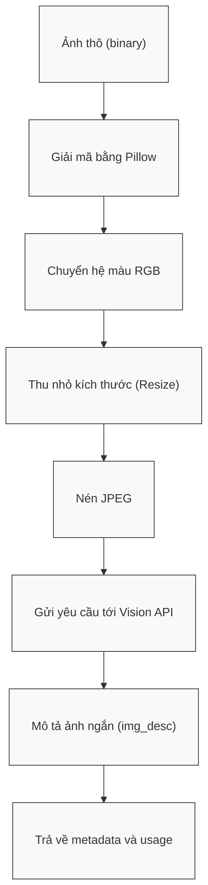

# Module N2: Xử lý Hình ảnh

**Dự án:** Travel Experience Planner  
**Ngày:** 2026-05-15

---

## 1. Vai trò của Module N2

N2 là lớp chuyển đổi dữ liệu thị giác thành tín hiệu ngữ nghĩa có thể dùng cho retrieval. Trong ngữ cảnh của hệ thống, người dùng không phải lúc nào cũng mô tả chính xác điều họ muốn bằng chữ. Nhiều khi họ chỉ có một hình ảnh gợi cảm hứng, ví dụ như ảnh bãi biển hoang sơ, quán cà phê nhìn ra thung lũng, hay một con đường núi có sương sớm. N2 được xây để biến loại tín hiệu cảm tính này thành một đoạn mô tả ngắn nhưng giàu ngữ nghĩa.

Điểm quan trọng là N2 không theo đuổi mục tiêu captioning đầy đủ. Module này không cần mô tả mọi vật thể trong ảnh. Thay vào đó, nó tập trung vào:

- loại địa điểm
- đặc điểm thị giác nổi bật nhất
- bầu không khí tổng thể
- sắc thái du lịch mà ảnh gợi ra

Nói cách khác, N2 không hỏi “trong ảnh có gì?”, mà hỏi “ảnh này gợi ra loại trải nghiệm du lịch nào?”.

---

## 2. Tư tưởng thiết kế: Vision-to-Text for Retrieval

Nếu trực tiếp dùng hình ảnh như một input riêng biệt trong toàn pipeline, hệ thống sẽ phải duy trì thêm một nhánh xử lý đa phương thức phức tạp ở nhiều module phía sau. Điều đó làm tăng độ khó triển khai và khó giữ giao diện dữ liệu thống nhất.

N2 giải quyết vấn đề này bằng một quyết định kiến trúc rất thực dụng:

- chuyển ảnh thành **một chuỗi văn bản ngắn**
- đưa chuỗi này vào cùng hệ sinh thái semantic embedding với `text` và `tags`

Thiết kế này có ba lợi ích lớn:

1. **Đơn giản hóa pipeline:** các bước phía sau chỉ cần làm việc với text và vector.
2. **Tận dụng toàn bộ hạ tầng ngữ nghĩa sẵn có:** mô tả ảnh có thể được nhúng, so khớp và xếp hạng như các kênh semantic khác.
3. **Dễ debug và dễ giải thích:** thay vì giữ một tensor hình ảnh mơ hồ, hệ thống có một `img_desc` đọc được bằng mắt người.

---

## 3. Công nghệ và lý do lựa chọn

N2 hiện sử dụng hạ tầng Groq Vision. Việc lựa chọn này dựa trên hai yếu tố:

- tốc độ phản hồi nhanh
- khả năng tạo mô tả ngữ nghĩa đủ tốt cho bài toán du lịch

Trong bài toán này, tốc độ là yếu tố quan trọng vì phân tích ảnh chỉ là một bước phụ trợ. Nếu bước này quá chậm, toàn bộ trải nghiệm của người dùng sẽ bị kéo dài dù phần còn lại của pipeline hoạt động tốt.

Ngoài ra, N2 không cần một model chuyên “phân tích vật thể cực sâu”, mà cần một model có thể hiểu được:

- vibe của cảnh
- phong cách du lịch
- cảm xúc tổng quát

Điều này phù hợp hơn với vision-language models có năng lực mô tả ngữ cảnh thay vì chỉ nhận diện đối tượng.

---

## 4. Giao diện công khai

```python
process_image(data: dict) -> dict
```

### 4.1. Cấu trúc đầu vào

```python
{
    "image": bytes,
}
```

Trong đó:

- `image` là dữ liệu ảnh thô ở dạng nhị phân

### 4.2. Cấu trúc đầu ra

Trường hợp thành công:

```python
{
    "img_desc": str,
    "metadata": {
        "model": str,
        "usage": {
            "prompt_tokens": int,
            "completion_tokens": int,
            "total_tokens": int,
        },
    },
}
```

Trường hợp lỗi:

```python
{
    "img_desc": "",
    "error": str,
    "metadata": {
        "model": str,
        "usage": dict,
    },
}
```

Điều cần lưu ý là đầu ra của N2 được thiết kế để:

- đủ ngắn để không gây nhiễu cho embedding
- đủ giàu nghĩa để đóng góp vào retrieval
- đủ rõ ràng để có thể hiển thị hoặc debug trực tiếp

---

## 5. Chiến lược prompting: Concise Semantic Captioning

Một quyết định quan trọng trong N2 là **ép mô tả ngắn** thay vì để model mô tả tự do.

### 5.1. Vì sao mô tả phải ngắn?

Nếu cho model tự do diễn đạt, nó thường:

- thêm câu mở đầu dư thừa
- mô tả quá chi tiết các vật thể không quan trọng
- dùng nhiều token cho những nội dung ít giá trị đối với retrieval

Ví dụ, với bài toán recommendation du lịch, việc mô tả “bầu trời xanh”, “có vài người đứng xa”, hay “một chiếc bàn gỗ ở góc trái” thường không hữu ích bằng việc nêu:

- đây là quán cà phê trên cao
- khung cảnh yên tĩnh
- phù hợp nghỉ dưỡng hoặc ngắm cảnh

Do đó, N2 dùng chiến lược prompting buộc model phải:

- trả lời ngắn
- tập trung vào đặc trưng du lịch
- tránh các chi tiết kỹ thuật ít giá trị

### 5.2. Lợi ích của concise prompting

Chiến lược này đem lại ba lợi ích:

1. **Tăng semantic density:** mỗi từ trong `img_desc` mang nhiều giá trị ngữ nghĩa hơn.
2. **Giảm chi phí và độ trễ:** ít token hơn.
3. **Làm sạch kênh ảnh cho bước embedding:** mô tả ngắn có xu hướng nhúng ổn định hơn mô tả dài và lan man.

---

## 6. Luồng xử lý kỹ thuật



Chuỗi xử lý hiện tại gồm:

1. đọc bytes ảnh
2. giải mã bằng Pillow
3. chuẩn hóa về RGB
4. downscale nếu ảnh quá lớn
5. nén về JPEG
6. gửi request đến Groq Vision
7. lấy mô tả đầu ra và metadata sử dụng token

### 6.1. Vì sao phải resize và re-encode?

Đây không chỉ là thao tác kỹ thuật phụ. Việc tối ưu ảnh trước khi gửi đi giúp:

- giảm payload size
- tránh lỗi vượt giới hạn request
- ổn định chất lượng phản hồi giữa các ảnh có định dạng khác nhau

Nó làm cho hành vi của module nhất quán hơn trong môi trường production.

---

## 7. Ý nghĩa của `img_desc` trong toàn hệ thống

Đầu ra của N2 là `img_desc`. Đây là một tín hiệu rất đặc biệt:

- không phải text do người dùng gõ trực tiếp
- cũng không phải tag có cấu trúc
- mà là một “diễn giải ngữ nghĩa” từ dữ liệu thị giác

Kênh này hữu ích nhất trong các tình huống:

- người dùng không diễn đạt rõ bằng chữ
- người dùng chỉ có cảm hứng hình ảnh
- text và tags quá ngắn hoặc mơ hồ

Trong những trường hợp đó, `img_desc` có thể bổ sung một lớp semantic rất khác với text thông thường, đặc biệt ở các thuộc tính như:

- không khí
- phong cách
- cảm xúc
- loại hình không gian

---

## 8. Ghi chú vận hành

- provider hiện tại là Groq Vision
- timeout request hiện tại là `60` giây
- đầu ra được ưu tiên bằng tiếng Việt
- ảnh trống hoặc lỗi decode sẽ dẫn đến payload lỗi có cấu trúc

---

## 9. Kết luận

N2 là một module nhỏ về mặt API nhưng có vai trò quan trọng trong trải nghiệm recommendation đa phương thức. Giá trị của N2 không nằm ở việc “phân tích ảnh cho đẹp”, mà ở việc tạo ra một kênh semantic phụ trợ cực kỳ thực dụng:

- nhẹ
- ngắn
- dễ nhúng
- có giá trị cho so khớp du lịch

Đây là ví dụ điển hình của một thiết kế vision module được tối ưu cho retrieval chứ không phải cho computer vision thuần túy.

---

## 10. Tài liệu tham khảo

| # | Chủ đề | Nguồn tham khảo |
|---|---|---|
| 1 | Groq Vision Documentation | [console.groq.com/docs/vision](https://console.groq.com/docs/vision) |
| 2 | Groq Models | [console.groq.com/docs/models](https://console.groq.com/docs/models) |
| 3 | Pillow Documentation | [pillow.readthedocs.io](https://pillow.readthedocs.io/) |
