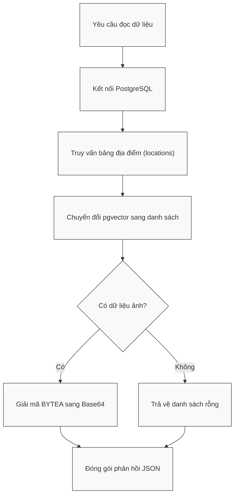
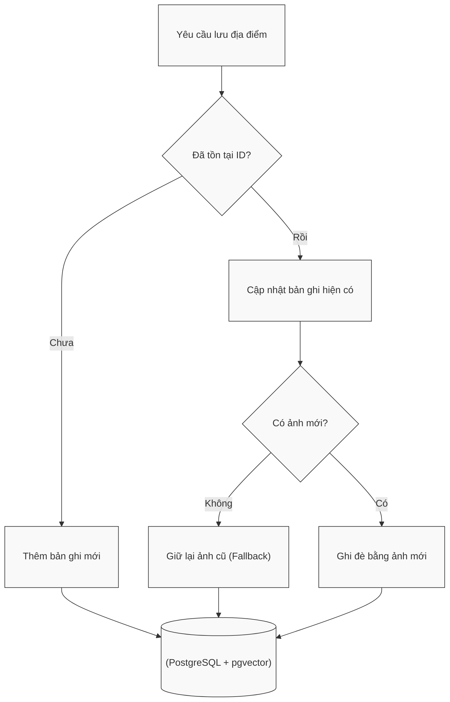

# Module N3: Tầng Dữ liệu và Lưu trữ

**Dự án:** Travel Experience Planner  
**Ngày:** 2026-05-15

---

## 1. Vai trò của Module N3

N3 là tầng persistence của hệ thống. Nếu N1 và N2 chịu trách nhiệm tạo ra biểu diễn ngữ nghĩa, thì N3 là nơi giữ cho toàn bộ các biểu diễn đó tồn tại bền vững và có thể truy xuất lại một cách nhất quán.

Trong dự án này, một bản ghi địa điểm không chỉ là một dòng text mô tả. Nó là một gói dữ liệu tổng hợp gồm:

- vector nhiều kênh
- metadata mô tả
- tọa độ hoặc thông tin địa lý
- ảnh nhị phân

Vì vậy, N3 không thể là một nơi chỉ “lưu vector”, mà phải là một lớp dữ liệu có khả năng mang đồng thời cả dữ liệu quan hệ, dữ liệu JSON và dữ liệu nhị phân.

---

## 2. Tư tưởng thiết kế: Unified Persistence

Một quyết định rất đáng chú ý của N3 là chọn **PostgreSQL + pgvector** thay vì tách dữ liệu thành nhiều hệ thống độc lập.

### 2.1. Vì sao không dùng một vector database riêng?

Về mặt lý thuyết, có thể tách:

- vector sang một vector DB
- metadata sang SQL
- ảnh sang file storage

Nhưng cách đó làm tăng mạnh chi phí đồng bộ và độ phức tạp hệ thống:

- nhiều nơi lưu trữ hơn
- nhiều điểm lỗi hơn
- khó đảm bảo tính nhất quán giữa vector, metadata và ảnh

Trong quy mô bài toán hiện tại, việc tập trung mọi thứ vào PostgreSQL đem lại lợi ích lớn hơn:

- dễ quản trị
- dễ reset
- dễ backup
- dễ đảm bảo một địa điểm luôn đi kèm đúng metadata và đúng ảnh của nó

### 2.2. Ý nghĩa của pgvector trong kiến trúc này

`pgvector` giúp N3 không chỉ lưu được vector mà còn giữ vector như một phần tự nhiên của dữ liệu địa điểm. Nhờ đó, một record có thể đồng thời mang:

- `text`
- `aug_text`
- `aug_tags`
- `img_desc`
- `metadata`
- `geo`
- `images`

Đây là một thiết kế “single source of truth” đúng nghĩa cho dữ liệu địa điểm.

---

## 3. Giao diện công khai

```python
init_db() -> None
save_location(location_data: dict[str, Any]) -> dict[str, Any]
get_all_locations(include_images: bool = True) -> dict[str, Any]
get_db_fingerprint() -> str
attach_image_to_location(location_dict: dict[str, Any]) -> dict[str, Any]
```

Ý nghĩa từng hàm:

- `init_db()`: khởi tạo lại schema lưu trữ
- `save_location()`: ghi hoặc cập nhật một địa điểm
- `get_all_locations()`: đọc toàn bộ dữ liệu theo cấu trúc API-ready
- `get_db_fingerprint()`: tạo dấu vân tay trạng thái dữ liệu
- `attach_image_to_location()`: helper tương thích cho payload địa điểm đã có ảnh

---

## 4. Cấu trúc lưu trữ

N3 tạo bảng `locations` với các cột chính:

- `location_id`
- `text`
- `aug_text`
- `aug_tags`
- `img_desc`
- `metadata`
- `geo`
- `images`
- `updated_at`

### 4.1. Ý nghĩa của thiết kế nhiều cột vector

Việc giữ riêng từng cột vector là một tiếp nối trực tiếp của tư tưởng multi-channel embedding ở N1. Điều này cho phép:

- truy xuất lại đúng kênh semantic đã được sinh
- giữ được khả năng giải thích nguồn tín hiệu
- hỗ trợ các bước xếp hạng dùng dynamic weighting

Nếu N3 chỉ lưu một vector hợp nhất duy nhất, rất nhiều lợi ích ở phía N1 sẽ bị mất.

### 4.2. Vì sao ảnh được lưu bằng `BYTEA[]`?

Quyết định này phản ánh một lựa chọn rất thực dụng:

- giữ ảnh đi cùng record dữ liệu
- giảm phụ thuộc vào file server ngoài
- giúp backup và reset dữ liệu dễ hơn

Tất nhiên, ở quy mô rất lớn, tách object storage có thể hợp lý hơn. Nhưng với hệ thống hiện tại, lưu trong DB giúp đơn giản hóa kiến trúc mà vẫn đủ mạnh.

---

## 5. Hợp đồng dữ liệu

### 5.1. Đầu vào của `save_location()`

```python
{
    "location_id": str,
    "vectors": {
        "text": list[float] | None,
        "aug_text": list[float] | None,
        "aug_tags": list[float] | None,
        "img_desc": list[float] | None,
    },
    "metadata": dict[str, Any],
    "geo": dict[str, Any],
    "images_binary": list[bytes],
}
```

### 5.2. Đầu ra của `save_location()`

```python
{
    "status": "success" | "error",
    "location_id": str,
    "message": str,
    "metadata": {
        "source": "postgresql",
        "latency_ms": int,
    },
}
```

### 5.3. Đầu ra của `get_all_locations()`

```python
{
    "status": "success" | "error",
    "total": int,
    "data": [
        {
            "location_id": str,
            "vectors": {
                "text": list[float] | None,
                "aug_text": list[float] | None,
                "aug_tags": list[float] | None,
                "img_desc": list[float] | None,
            },
            "metadata": dict[str, Any] | None,
            "geo": dict[str, Any] | None,
            "images": list[str],
        }
    ],
    "metadata": {
        "source": "postgresql",
        "latency_ms": int,
    },
}
```

Trong đó, `images` được trả về dưới dạng Base64 data URI. Đây là một quyết định chuyển đổi rất thực dụng: DB vẫn lưu nhị phân, nhưng API trả về định dạng dễ render ở UI.

---

## 6. Các quyết định hành vi quan trọng

### 6.1. `init_db()` có tính destructive

`init_db()` hiện không phải migration tool, mà là reset-schema tool:

1. đảm bảo extension `vector` tồn tại
2. xóa bảng `locations`
3. tạo lại từ đầu

Điều này phù hợp với các giai đoạn:

- seed dữ liệu
- benchmark
- reset môi trường thí nghiệm

Nó đơn giản nhưng rất rõ ràng về mặt hành vi.

### 6.2. Upsert thay vì insert cứng

`save_location()` dùng `ON CONFLICT` theo `location_id`. Quyết định này giúp:

- cập nhật dữ liệu địa điểm mà không cần xóa rồi chèn lại
- làm mới vector, metadata và geo an toàn
- giữ lại ảnh cũ nếu payload mới không cung cấp ảnh

Đây là một quyết định tốt vì ảnh thường là phần nặng nhất và không nhất thiết phải truyền lại mỗi lần update metadata.

### 6.3. Fingerprinting để hỗ trợ đồng bộ

`get_db_fingerprint()` hiện dựa trên:

- tổng số record
- `MAX(updated_at)`

Đây là một cơ chế fingerprint rẻ nhưng hiệu quả. Nó không cần hash toàn bộ dữ liệu, nhưng vẫn đủ mạnh để phát hiện:

- có thêm record mới
- có record vừa bị cập nhật

Về mặt kiến trúc, đây là một lựa chọn cân bằng rất tốt giữa chi phí và khả năng phát hiện thay đổi.

---

## 7. Luồng truy xuất dữ liệu





Luồng này cho thấy rõ vai trò “adapter” của N3:

- bên trong là dữ liệu DB-native
- bên ngoài là dữ liệu API-native

---

## 8. Ghi chú vận hành

- kết nối dùng `psycopg2` với `RealDictCursor`
- `register_vector()` được gọi trên từng kết nối mới
- vector được trả về dưới dạng list Python để thuận tiện cho các module phía trên
- logging và chuỗi kết nối lấy từ cấu hình dự án

---

## 9. Kết luận

N3 không chỉ là nơi lưu dữ liệu. Nó là tầng đảm bảo rằng mọi tài sản semantic của hệ thống:

- được lưu bền vững
- được truy xuất có cấu trúc
- và có thể đồng bộ hiệu quả với lớp điều phối

Giá trị lớn nhất của N3 nằm ở sự thống nhất: cùng một record địa điểm có thể chứa đầy đủ vector, metadata, geo và ảnh. Đây là một quyết định kiến trúc gọn, thực dụng và rất phù hợp với hệ thống recommendation quy mô học thuật nhưng đủ nghiêm túc để benchmark và demo end-to-end.

---

## 10. Tài liệu tham khảo

| # | Chủ đề | Nguồn tham khảo |
|---|---|---|
| 1 | pgvector GitHub | [github.com/pgvector/pgvector](https://github.com/pgvector/pgvector) |
| 2 | PostgreSQL Documentation | [www.postgresql.org/docs](https://www.postgresql.org/docs/) |
| 3 | Psycopg2 Documentation | [www.psycopg.org/docs/](https://www.psycopg.org/docs/) |
