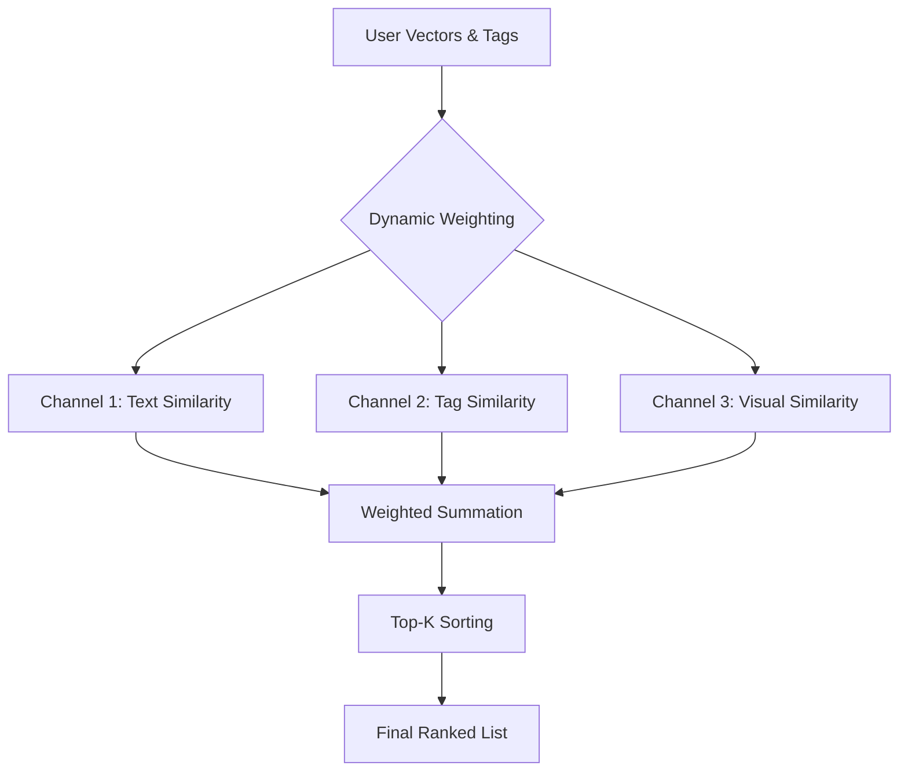

# Module N4: Xếp hạng Địa điểm (Location Ranking)

**Dự án:** Travel Experience Planner  
**Ngày:** 2026-05-14  

---

## 1. Vai trò của Module N4

Module N4 là bộ não quyết định địa điểm nào phù hợp nhất với nhu cầu của người dùng. Nó thực hiện việc so khớp các vector sở thích của người dùng với cơ sở dữ liệu địa điểm để đưa ra danh sách xếp hạng theo thứ tự độ liên quan giảm dần.

---

## 2. Logic Xếp hạng: Weighted Cosine Similarity

N4 sử dụng thuật toán **Độ tương đồng Cosine có trọng số** trên nhiều kênh dữ liệu đồng thời.

### Các kênh so khớp chính:
1.  **Text vs Location Text:** So khớp ý định thô của người dùng với mô tả địa điểm.
2.  **Augmented Tags vs Location Tags:** So khớp các từ khóa đã được mở rộng ngữ nghĩa.
3.  **Image Description vs Location Text:** So khớp nội dung hình ảnh người dùng cung cấp với đặc điểm địa điểm.

---

## 3. Cơ chế Trọng số Động (Dynamic Weighting)

Đây là điểm thông minh của N4. Thay vì dùng một trọng số cố định cho mọi trường hợp, N4 điều chỉnh dựa trên tín hiệu từ Module N1:
-   **Ưu tiên Tags:** Khi người dùng chọn nhiều tags cụ thể, hệ thống sẽ tin tưởng vào kênh `aug_tags`.
-   **Ưu tiên Mô tả:** Khi người dùng viết một đoạn văn dài, hệ thống sẽ ưu tiên kênh `text`.
-   **Bù đắp ngữ nghĩa:** Khi thông tin thưa thớt, kênh `aug_text` (phần đã được mở rộng) sẽ được đẩy lên cao để tìm kiếm hiệu quả hơn.

---

## 4. Luồng Xếp hạng (Ranking Pipeline)

## 5. Quy trình xử lý (Process)

1.  **Tiếp nhận:** Nhận bộ vector người dùng và danh sách địa điểm tiềm năng.
2.  **Tính toán:** Tính điểm Cosine Similarity cho từng cặp User-Location trên tất cả các kênh.
3.  **Áp trọng số:** Nhân điểm số từng kênh với bộ trọng số động tương ứng.
4.  **Tổng hợp:** Cộng dồn điểm số để có `Final Score` nằm trong khoảng [0.0, 1.0].
5.  **Sắp xếp:** Lọc lấy Top-K kết quả cao nhất.

---

## 5. Giao diện (Interface)

-   **Input:** 
    -   `user_vectors`: Bộ vector sở thích.
    -   `locations`: Danh sách dữ liệu địa điểm từ database.
    -   `text_k`, `tags_k`: Các tín hiệu điều khiển trọng số.
-   **Output:** Danh sách địa điểm đã được xếp hạng, kèm theo điểm số (`score`) và lý do gợi ý (`reason`).

---

## 6. Tài liệu tham khảo

| # | Chủ đề | Nguồn tham khảo |
|---|---|---|
| 1 | Pinecone — Vector similarity: cosine vs dot product | [pinecone.io/learn/vector-similarity](https://www.pinecone.io/learn/vector-similarity/) |
| 2 | Hệ thống Trọng số Động (Internal Docs) | [docs/dynamic_weighting.md](dynamic_weighting.md) |
| 3 | BGE-M3 — Semantic similarity best practices | [huggingface.co/BAAI/bge-m3](https://huggingface.co/BAAI/bge-m3) |