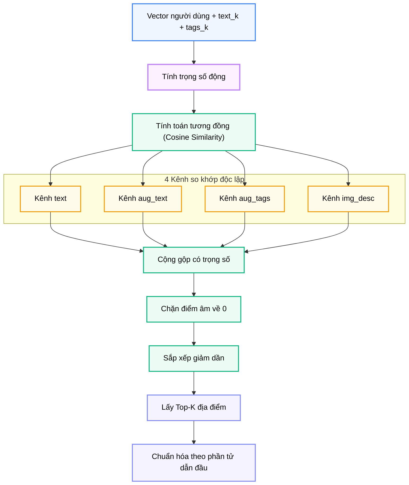

# Module N4: Xếp hạng Địa điểm

**Dự án:** Travel Experience Planner  
**Ngày:** 2026-05-15

---

## 1. Vai trò của Module N4

N4 là bộ máy quyết định địa điểm nào phù hợp nhất với nhu cầu người dùng tại thời điểm truy vấn. Nếu N1 chịu trách nhiệm tạo ra biểu diễn ngữ nghĩa, thì N4 là nơi những biểu diễn đó được đưa vào tính toán để tạo thành thứ tự ưu tiên.

Trong hệ thống recommendation, đây là bước quan trọng vì:

- dữ liệu địa điểm thường nhiều hơn số kết quả cần trả
- nhiều địa điểm có semantic gần nhau
- các nguồn tín hiệu đầu vào không đồng đều về chất lượng

Do đó, N4 không thể chỉ tính một similarity đơn giản rồi sort. Nó cần một cơ chế xếp hạng biết cân nhắc từng kênh semantic theo mức độ tin cậy của truy vấn.

---

## 2. Tư tưởng thiết kế: Weighted Multi-channel Ranking

N4 sử dụng **weighted cosine similarity** trên nhiều kênh semantic thay vì một vector duy nhất.

### 2.1. Các kênh so khớp hiện tại

- `text` -> `text`
- `aug_text` -> `text`
- `aug_tags` -> `aug_tags`
- `img_desc` -> `text`

Mỗi cặp kênh đại diện cho một kiểu tín hiệu:

- **Text trực tiếp:** ý định người dùng được diễn đạt bằng lời
- **Augmented text:** ý định sau khi đã được làm giàu ngữ nghĩa
- **Augmented tags:** tín hiệu sở thích có cấu trúc
- **Image description:** tín hiệu thị giác chuyển sang văn bản

### 2.2. Vì sao phải giữ nhiều kênh?

Nếu chỉ dùng một vector tổng hợp, hệ thống sẽ mất khả năng:

- biết truy vấn mạnh ở text hay tags
- ưu tiên kênh nào khi một số trường đầu vào yếu
- giải thích kết quả xếp hạng theo nguồn tín hiệu

Thiết kế nhiều kênh ở N4 là phần logic tiếp nối trực tiếp của N1 và là nơi ý tưởng **dynamic weighting** phát huy tác dụng rõ nhất.

---

## 3. Dynamic Weighting: Trọng số theo chất lượng tín hiệu

Một trong những điểm học thuật có giá trị nhất của N4 là không coi mọi kênh semantic có trọng lượng cố định.

Module sử dụng:

- `text_k`
- `tags_k`

để suy ra mức độ đáng tin cậy của từng kênh.

### 3.1. Ý nghĩa của chiến lược này

Trong recommendation thực tế:

- có truy vấn mạnh ở text nhưng yếu ở tags
- có truy vấn nhiều tags rõ nghĩa nhưng text rất ngắn
- có truy vấn dùng ảnh như tín hiệu phụ trợ

Nếu luôn dùng cùng một bộ trọng số, hệ thống sẽ thiếu linh hoạt và dễ bị bias theo một dạng đầu vào cụ thể.

Dynamic weighting cho phép:

- tăng vai trò của `aug_tags` khi tags rõ và nhiều
- tăng vai trò của `aug_text` khi text ngắn nhưng augmentation tìm ra tín hiệu tốt
- giữ kênh ảnh như tín hiệu hỗ trợ, không lấn át toàn bộ truy vấn

Đây là bước biến semantic retrieval từ “naive similarity search” thành một cơ chế ranking có thích nghi.

---

## 4. Giao diện công khai

```python
rank_locations(data: dict[str, Any]) -> dict[str, Any]
```

### 4.1. Cấu trúc đầu vào

```python
{
    "text_k": int,
    "tags_k": int,
    "user_vectors": {
        "text": list[float] | None,
        "aug_text": list[float] | None,
        "aug_tags": list[float] | None,
        "img_desc": list[float] | None,
    },
    "locations": [
        {
            "location_id": str,
            "location_vectors": {
                "text": list[float] | None,
                "aug_tags": list[float] | None,
            },
        }
    ],
    "top_k": int,
}
```

### 4.2. Cấu trúc đầu ra

```python
{
    "locations": [
        {
            "location_id": str,
            "score": float,
            "reason": str,
        }
    ],
    "metadata": {
        "text_k": int,
        "tags_k": int,
        "weights": {
            "text": float,
            "aug_text": float,
            "aug_tags": float,
            "img_desc": float,
        },
        "latency_ms": int,
    },
}
```

`metadata.weights` là phần rất có giá trị cho báo cáo vì nó cho thấy hệ thống không xếp hạng một cách “mù”, mà có logic điều tiết rõ ràng dựa trên tín hiệu đầu vào.

---

## 5. Công thức tính điểm

Ở mức khái niệm, score cho một địa điểm được tạo bằng:

```text
score = w_text * sim(text, loc_text)
      + w_aug_text * sim(aug_text, loc_text)
      + w_aug_tags * sim(aug_tags, loc_aug_tags)
      + w_img_desc * sim(img_desc, loc_text)
```

Trong đó:

- `sim` là cosine similarity
- các `w_*` được resolve động từ `text_k` và `tags_k`

### 5.1. Vì sao dùng cosine similarity?

Vì các vector đã được chuẩn hóa từ trước, cosine similarity phù hợp bởi:

- dễ diễn giải
- ít nhạy với độ lớn vector
- ổn định trong semantic retrieval

Ngoài ra, nếu một vector:

- bị thiếu
- rỗng
- lệch chiều

thì module trả similarity `0.0` cho kênh đó thay vì làm hỏng toàn bộ ranking. Đây là một quyết định tốt về robustness.

---

## 6. Luồng xếp hạng



Quy trình thực thi:

1. đọc input truy vấn và danh sách địa điểm
2. resolve weights từ tín hiệu `text_k`, `tags_k`
3. tính score cho từng địa điểm độc lập
4. sort giảm dần
5. cắt `top_k`
6. chuẩn hóa score để dễ hiển thị

---

## 7. Cơ chế tạo `reason`

N4 không sinh explanation dài bằng LLM. Thay vào đó, nó tạo một lý do ngắn từ các kênh có:

- trọng số đang hoạt động
- similarity đủ mạnh

Ví dụ:

- phù hợp yêu cầu
- phù hợp sở thích
- hình ảnh tương đồng

Đây là lựa chọn hợp lý vì:

- nhanh
- ổn định
- nhất quán với score thực tế

Tức là `reason` không phải văn bản "đẹp" theo kiểu generative AI, mà là phần giải thích tối giản nhưng có căn cứ định lượng.

---

## 8. Ghi chú vận hành

- score âm được chặn về `0.0`
- score cuối được chuẩn hóa tương đối theo phần tử đứng đầu
- nếu không có địa điểm đầu vào, module trả danh sách rỗng và `latency_ms = 0`
- module ghi log về trọng số đã resolve và thời gian xử lý

---

## 9. Kết luận

N4 là nơi ý tưởng semantic retrieval của hệ thống được chuyển thành hành vi recommendation cụ thể. Giá trị lớn nhất của module này nằm ở việc:

- không dùng một score semantic đơn giản
- tận dụng multi-channel embedding
- áp dụng **dynamic weighting** dựa trên chất lượng tín hiệu đầu vào

Đây là điểm giúp hệ thống recommendation trở nên linh hoạt hơn, phù hợp hơn với dữ liệu người dùng không đồng đều, và dễ giải thích hơn trong báo cáo kỹ thuật.

---

## 10. Tài liệu tham khảo

| # | Chủ đề | Nguồn tham khảo |
|---|---|---|
| 1 | Vector similarity và cosine similarity | [pinecone.io/learn/vector-similarity](https://www.pinecone.io/learn/vector-similarity/) |
| 2 | Tài liệu dynamic weighting của dự án | [docs/architecture/dynamic_weighting.md](../architecture/dynamic_weighting.md) |
