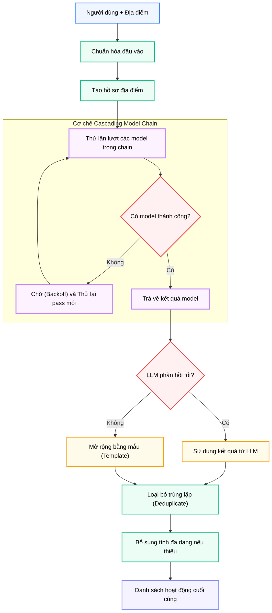

# Module N5: Sinh Hoạt động Du lịch

**Dự án:** Travel Experience Planner  
**Ngày:** 2026-05-15

---

## 1. Vai trò của Module N5

Sau khi hệ thống xác định được “nên đi đâu”, N5 trả lời câu hỏi tiếp theo: “đến đó thì nên làm gì?”. Đây là module sáng tạo nội dung của pipeline, nhưng đồng thời cũng là module phải kiểm soát chất lượng rất chặt, vì đầu ra của nó không chỉ để hiển thị mà còn còn được xếp hạng và giải thích ở các bước sau.

Do đó, N5 phải thỏa mãn đồng thời hai mục tiêu tưởng như mâu thuẫn:

- **sáng tạo đủ tốt** để hoạt động nghe hợp lý và hấp dẫn
- **ổn định đủ cao** để luôn trả ra output có cấu trúc chuẩn

Chính vì vậy, N5 được thiết kế như một hệ thống **LLM-first, template-backup** thay vì phụ thuộc hoàn toàn vào sinh ngôn ngữ tự do.

---

## 2. Tư tưởng thiết kế: Kết hợp sáng tạo và kiểm soát

### 2.1. Vì sao không chỉ dùng template?

Nếu chỉ dùng template:

- hoạt động sẽ an toàn nhưng dễ lặp
- thiếu tính cá nhân hóa
- khó tạo cảm giác “đề xuất thông minh”

### 2.2. Vì sao không chỉ dùng LLM?

Nếu chỉ dùng LLM:

- đầu ra dễ lệch schema
- chất lượng có thể dao động mạnh
- dễ gặp lỗi rate limit hoặc lỗi parse

### 2.3. Lý do chọn kiến trúc hybrid

N5 chọn chiến lược lai vì đây là điểm cân bằng tốt:

- LLM đảm nhận vai trò sáng tạo nội dung
- template đảm nhận vai trò ổn định cấu trúc và phủ fallback

Đây là một quyết định kiến trúc rất hợp lý cho bài toán sinh nội dung trong môi trường có giới hạn API và yêu cầu end-to-end stability.

---

## 3. Giao diện công khai

```python
generate_activities(data: dict[str, Any]) -> dict[str, Any]
```

### 3.1. Cấu trúc đầu vào

```python
{
    "user": {
        "text": str | None,
        "img_desc": str | None,
        "tags": list[str] | str | None,
    },
    "locations": [
        {
            "location_id": str,
            "metadata": {
                "name": str | None,
                "description": str | None,
                "tags": list[str] | None,
            },
        }
    ],
    "constraints": {
        "time_of_day": str | None,
    },
}
```

### 3.2. Cấu trúc đầu ra

```python
{
    "activities": [
        {
            "activity_id": str,
            "location_id": str,
            "metadata": {
                "name": str,
                "description": str,
                "tags": list[str],
                "activity_type": str,
                "intensity": float,
                "physical_level": float | None,
                "social_level": float | None,
            },
        }
    ],
    "metadata": {
        "per_location": [
            {
                "location_id": str,
                "provider_used": str | None,
                "model_used": str | None,
                "usage": dict | None,
                "latency_ms": int,
            }
        ],
        "latency_ms": int,
    },
}
```

Output này có hai lớp giá trị:

- `activities`: dữ liệu để hiển thị và xếp hạng
- `metadata`: dữ liệu để quan sát chất lượng generation

---

## 4. Quy trình sinh hoạt động



Các bước thực thi cho mỗi địa điểm:

1. chuẩn hóa user, tags và constraints
2. dựng hoặc enrich hồ sơ địa điểm
3. gọi LLM để sinh hoạt động
4. kiểm tra số lượng hoạt động hợp lệ
5. nếu chưa đủ ngưỡng, bổ sung hoặc fallback bằng template
6. deduplicate theo tên
7. trả tập hoạt động cuối cùng

---

## 5. Location Profile Enrichment

Một điểm đáng chú ý của N5 là nó không chỉ đọc metadata địa điểm một cách thụ động. Module còn cố gắng xây dựng một **location profile** phong phú hơn từ:

- tên địa điểm
- tags hiện có
- description
- profile mẫu nếu tìm thấy

### 5.1. Vì sao bước này quan trọng?

LLM sinh nội dung tốt hơn nhiều khi ngữ cảnh địa điểm rõ. Nếu chỉ truyền một tên địa điểm ngắn, model dễ sinh hoạt động chung chung. Nhưng khi được cung cấp thêm:

- đặc điểm địa hình
- tính chất du lịch
- vùng miền
- tín hiệu từ tags

thì output trở nên đúng ngữ cảnh hơn.

Đây là ví dụ rõ của một kỹ thuật **context enrichment** trước generation.

---

## 6. LLM-first Strategy

Khi LLM khả dụng, N5 sẽ ưu tiên dùng đường sinh bằng model trước.

### 6.1. Lợi ích của cách tiếp cận này

- hoạt động giàu ngôn ngữ hơn
- mô tả bớt máy móc hơn
- phù hợp hơn với sở thích cá nhân
- có thể tạo những tổ hợp ý tưởng mà template không bao phủ hết

### 6.2. Vì sao không nhận toàn bộ output LLM vô điều kiện?

Vì output từ LLM luôn có rủi ro:

- thiếu trường bắt buộc
- mô tả không nhất quán
- số lượng hoạt động quá ít
- tag không hợp lệ

Do đó, N5 chỉ chấp nhận output khi đủ ngưỡng tối thiểu, nếu không sẽ chuyển sang cơ chế bù bằng template hoặc fallback hoàn toàn.

---

## 7. Template Expansion và Fallback

Khi LLM không đủ tốt, N5 dùng máy sinh template.

### 7.1. Vai trò của template

Template không nhằm thay thế hoàn toàn tính sáng tạo, mà để đảm bảo:

- hệ thống luôn có đầu ra
- output luôn đúng schema
- mức độ đa dạng không rơi về 0

### 7.2. Cách template được mở rộng

Template không chỉ được chép nguyên xi. N5 còn:

- lọc template tương thích với location tags
- chấm độ ưu tiên theo sightseeing relevance
- sắp xếp theo độ liên quan với user tags
- thêm variation modifiers để tạo khác biệt tên và mô tả

Nhờ đó, fallback không quá “cứng”, mà vẫn có một mức biến thiên hợp lý.

---

## 8. Ý nghĩa của metadata hoạt động

Mỗi hoạt động được trả về không chỉ có:

- `name`
- `description`

mà còn có các trục hành vi:

- `activity_type`
- `intensity`
- `physical_level`
- `social_level`

Đây là một quyết định rất quan trọng vì N5 không chỉ sinh text để đọc, mà sinh **dữ liệu có thể chấm điểm tiếp**. Ba trục số phía trên chính là cầu nối giữa generation và ranking.

Nói cách khác, N5 đang sinh ra “candidates có cấu trúc”, không phải chỉ sinh “nội dung đẹp”.

---

## 9. Ghi chú vận hành

- module có thể short-circuit về kết quả rỗng nếu cấu hình target count bằng `0`
- kết quả trả về chứa metadata provider/model để phục vụ benchmark
- có cơ chế deduplicate theo tên hoạt động
- có logic tăng tỷ lệ hoạt động dạng sightseeing để giữ độ đa dạng hiển thị

---

## 10. Kết luận

N5 là nơi hệ thống bước từ retrieval sang generation. Giá trị lớn nhất của module này không nằm ở việc gọi LLM, mà ở cách kiểm soát rủi ro của generation:

- enrich ngữ cảnh trước khi sinh
- dùng LLM khi có lợi thế
- dùng template khi cần ổn định
- giữ đầu ra luôn có cấu trúc chặt chẽ

Đây là một kiến trúc generation rất phù hợp với bài toán học thuật có yêu cầu demo thực chiến: vừa thể hiện được tính thông minh của AI, vừa đủ ổn định để không làm sập cả pipeline.

---

## 11. Tài liệu tham khảo

| # | Chủ đề | Nguồn tham khảo |
|---|---|---|
| 1 | Groq Structured Outputs | [console.groq.com/docs/structured-outputs](https://console.groq.com/docs/structured-outputs) |
| 2 | JSON Schema Concepts | [json-schema.org](https://json-schema.org/) |
