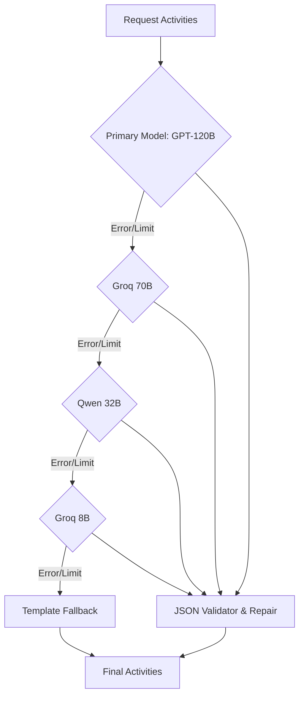

# Module N5: Sinh Hoạt động Du lịch (Activity Generation)

**Dự án:** Travel Experience Planner  
**Ngày:** 2026-05-14  

---

## 1. Vai trò của Module N5

Sau khi đã xác định được địa điểm phù hợp ở bước N4, Module N5 có nhiệm vụ sáng tạo ra các hoạt động du lịch cụ thể và cá nhân hóa cho người dùng tại địa điểm đó. N5 kết hợp giữa sức mạnh sáng tạo của AI và tính ổn định của các dữ liệu mẫu (templates).

---

## 2. Công nghệ: LLM Chain & Failover

N5 sử dụng một chuỗi các mô hình ngôn ngữ lớn (LLM) thông qua Groq để đảm bảo tính sẵn sàng và chất lượng cao nhất.

### Cơ chế Failover tự động:
Để đối phó với giới hạn Rate Limit của các model miễn phí, N5 triển khai một chuỗi model dự phòng:
`gpt_120b` → `groq_70b` → `qwen_32b` → `groq_8b` → ...
Nếu model ưu tiên cao gặp lỗi hoặc bị quá tải, hệ thống tự động chuyển sang model tiếp theo trong chuỗi cho đến khi nhận được kết quả hợp lệ.

---

## 3. Kiến trúc Failover (Resilience Pattern)

## 4. Quy trình Đảm bảo Chất lượng (Quality Assurance)

Việc sinh dữ liệu từ LLM luôn tiềm ẩn rủi ro về cấu trúc. N5 áp dụng quy trình 3 bước để đảm bảo dữ liệu đầu ra luôn chuẩn xác:

1.  **JSON Mode:** Ép buộc LLM trả về định dạng JSON thông qua API setting.
2.  **Auto-Repair Parser:** Nếu kết quả bị cắt ngang (truncate) hoặc lỗi cú pháp nhẹ, bộ parser sẽ tự động khôi phục các object hợp lệ cuối cùng.
3.  **Schema Validation:** Kiểm tra từng hoạt động sinh ra phải có đủ các trường: `name`, `description`, `intensity`, `physical_level`, `social_level`.

---

## 4. Cơ chế Fallback về Template

Nếu toàn bộ LLM Chain không thể trả về kết quả (do lỗi mạng hoặc quá tải nghiêm trọng), hệ thống sẽ kích hoạt **Template Fallback**:
-   Sử dụng danh sách các hoạt động đặc trưng đã được biên soạn sẵn cho từng địa điểm.
-   Đảm bảo người dùng luôn nhận được gợi ý hoạt động, không bao giờ gặp màn hình trống.

---

## 5. Thiết kế Giao diện (Clean Interface)

Module N5 tuân thủ nguyên tắc tách biệt giữa **Dữ liệu thực thi** và **Cấu hình hệ thống**:

-   **Input (Dữ liệu thực thi):** 
    -   Thông tin người dùng: `user` (text, tags, img_desc).
    -   Thông tin địa điểm: `locations` (metadata của các địa điểm mục tiêu).
    -   Ràng buộc: `constraints`.
-   **Configuration (Import nội bộ):** 
    -   N5 không nhận các tham số điều khiển qua interface. Mọi thông số như `target_count`, `llm_chain`, `retry_limit` đều được import trực tiếp từ **Global Config**. Điều này đảm bảo tính nhất quán của hệ thống và tránh việc Orchestrator can thiệp quá sâu vào logic nội bộ của module.
-   **Output:** Danh sách các `Activity Objects` đã qua kiểm định chất lượng.

---

## 6. Tài liệu tham khảo

| # | Chủ đề | Nguồn tham khảo |
|---|---|---|
| 1 | Groq — Danh sách model và TPM limits | [console.groq.com/docs/models](https://console.groq.com/docs/models) |
| 2 | Groq — JSON mode và Structured Outputs | [console.groq.com/docs/structured-outputs](https://console.groq.com/docs/structured-outputs) |