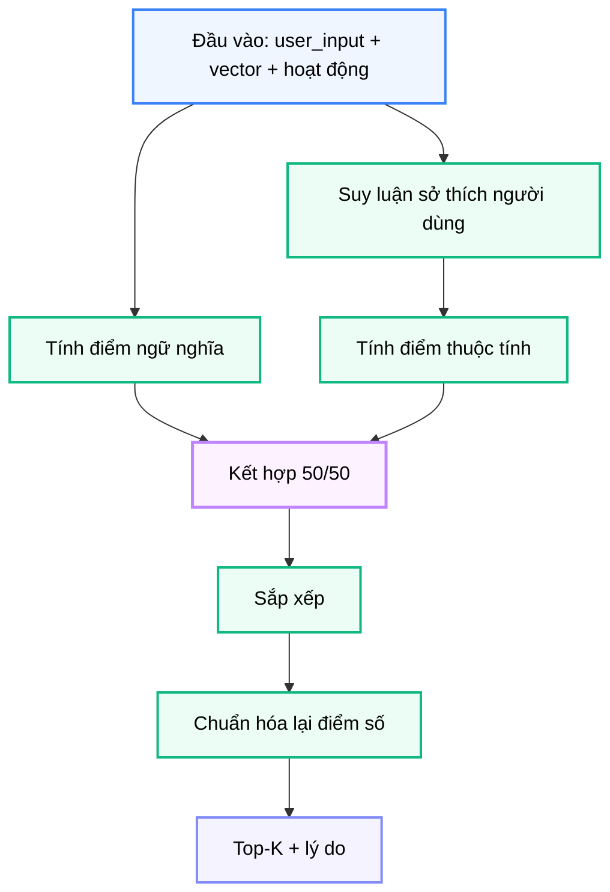

# Module N6: Xếp hạng Hoạt động

**Dự án:** Travel Experience Planner  
**Ngày:** 2026-05-15

---

## 1. Vai trò của Module N6

N6 là lớp ra quyết định cuối cùng cho danh sách hoạt động. Sau khi N5 sinh nhiều hoạt động ứng viên, N6 xác định hoạt động nào thực sự phù hợp nhất với người dùng tại thời điểm hiện tại.

Điểm đặc biệt của N6 là nó không chỉ xét “hoạt động này có liên quan về mặt ngữ nghĩa hay không”, mà còn xét:

- mức độ sôi nổi
- độ đòi hỏi thể lực
- tính xã hội

Nhờ đó, hệ thống không chỉ trả hoạt động “đúng chủ đề”, mà còn cố gắng trả hoạt động “đúng phong cách”.

---

## 2. Tư tưởng thiết kế: Hybrid Ranking

Nếu chỉ dựa vào semantic similarity, hai hoạt động có thể cùng nói về thiên nhiên hoặc khám phá nhưng vẫn khác nhau rất nhiều về trải nghiệm thực tế. Ví dụ:

- trekking xuyên núi
- ngắm cảnh bằng cáp treo

Cả hai đều có thể gần nhau về ngữ nghĩa “khám phá cảnh đẹp”, nhưng khác rất xa về:

- intensity
- thể lực
- kiểu tương tác

Do đó, N6 chọn mô hình **hybrid scoring**:

```text
0.5 * semantic_score + 0.5 * attribute_score
```

Đây là một quyết định thiết kế rất hợp lý: semantic đảm bảo đúng chủ đề, còn attribute đảm bảo đúng gu trải nghiệm.

---

## 3. Giao diện công khai

```python
rank_activities(data: dict[str, Any]) -> dict[str, Any]
infer_user_preferences(user_input: dict[str, Any]) -> dict[str, float | None]
```

### 3.1. Cấu trúc đầu vào cho `rank_activities()`

```python
{
    "user_input": {
        "text": str | None,
        "img_desc": str | None,
        "tags": list[str] | None,
    },
    "user_vectors": {
        "text": list[float] | None,
        "aug_text": list[float] | None,
        "aug_tags": list[float] | None,
        "img_desc": list[float] | None,
    },
    "activities": [
        {
            "activity_id": str,
            "location_id": str,
            "metadata": {
                "name": str,
                "description": str,
                "tags": list[str],
                "activity_type": str,
                "intensity": float,
                "physical_level": float | None,
                "social_level": float | None,
            },
            "vectors": {
                "text": list[float] | None,
                "tag": list[float] | None,
            },
        }
    ],
    "context": {
        "time_of_day": str | None,
    },
    "text_k": int,
    "tags_k": int,
    "top_k": int,
}
```

### 3.2. Cấu trúc đầu ra

```python
{
    "activities": [
        {
            "activity_id": str,
            "location_id": str,
            "score": float,
            "reason": str,
        }
    ],
    "metadata": {
        "user_prefs": {
            "intensity": float | None,
            "physical": float | None,
            "social": float | None,
        },
        "weights": {
            "text": float,
            "aug_text": float,
            "aug_tags": float,
            "img_desc": float,
        },
        "text_k": int,
        "tags_k": int,
        "latency_ms": int,
    },
}
```

Phần `metadata.user_prefs` là một điểm rất đáng giá trong báo cáo vì nó làm rõ rằng hệ thống không hề “xếp hạng hộp đen”, mà có một tầng suy luận hành vi rõ ràng trước khi chấm điểm.

---

## 4. Semantic Score

Semantic score trong N6 dùng lại tinh thần multi-channel retrieval:

- `aug_tags` -> `tag`
- `aug_text` -> `text`
- `text` -> `text`

Các similarity này được tính bằng cosine similarity, sau đó tổng hợp bằng bộ trọng số resolve từ:

- `text_k`
- `tags_k`

### 4.1. Dead-zone scaling

Một chi tiết rất đáng chú ý trong code là semantic score sau đó còn được “kéo giãn” khỏi vùng bão hòa cao bằng công thức:

```python
(sem_score - 0.5) * 2.0
```

Vì sao cần bước này?

Trong cùng một domain du lịch, nhiều embedding thường khá gần nhau. Nếu giữ nguyên khoảng similarity gốc, score sẽ dễ bị dồn về vùng cao và khó phân biệt các activity gần nhau. Dead-zone scaling giúp:

- tăng khoảng cách phân biệt
- làm top results dễ đọc hơn
- giúp semantic score có tác dụng phân lớp thực tế hơn

Đây là một chi tiết nhỏ nhưng rất có ý nghĩa về mặt ranking quality.

---

## 5. Attribute Score

Attribute score đo mức phù hợp giữa đặc tính hoạt động và thiên hướng người dùng trên ba trục:

- `intensity`
- `physical_level`
- `social_level`

### 5.1. Vì sao cần ba trục này?

Trong recommendation du lịch, khác biệt giữa các hoạt động không chỉ nằm ở nội dung mà còn ở cách trải nghiệm:

- có hoạt động ngắm cảnh nhẹ nhàng
- có hoạt động vận động mạnh
- có hoạt động thích hợp đi nhóm
- có hoạt động phù hợp đi một mình

Việc đưa ba trục này vào scoring giúp hệ thống phản ánh đúng “style fit”, chứ không chỉ “topic fit”.

### 5.2. Cách chấm điểm

Mỗi trục được tính theo nguyên tắc:

- càng gần preference mục tiêu thì điểm càng cao
- nếu thiếu dữ liệu ở trục nào thì bỏ qua trục đó

Đây là quyết định rất tốt về fairness, vì nó tránh phạt oan những hoạt động thiếu một vài metadata phụ.

---

## 6. Suy luận sở thích người dùng

Hàm `infer_user_preferences()` là một phần rất đáng để nhấn mạnh trong báo cáo, vì nó thể hiện tư duy rule-based gọn nhưng hiệu quả.

### 6.1. Dữ liệu dùng để suy luận

Hàm đọc:

- `tags`
- `text`
- `img_desc`

### 6.2. Cách suy luận

Module dùng:

- bảng trọng số theo tags
- keyword scan trong text và image description
- sigmoid để đưa kết quả về khoảng `[0, 1]`

Nếu không có đủ tín hiệu cho một trục, kết quả của trục đó là `None`.

### 6.3. Lợi ích của cách tiếp cận rule-based

Thay vì dùng thêm một LLM hoặc model phụ để suy luận preference, cách làm này có lợi ở:

- deterministic
- dễ giải thích
- dễ benchmark
- chi phí thấp

Đây là một lựa chọn rất hợp với môi trường đồ án và báo cáo kỹ thuật, vì logic xếp hạng luôn có thể truy vết được.

---

## 7. Luồng xử lý



Quy trình thực thi:

1. nhận user input, vectors và danh sách hoạt động
2. suy luận preference trên ba trục
3. tính semantic score
4. tính attribute score
5. trộn hai score theo tỷ lệ 50/50
6. sort toàn bộ hoạt động
7. rescale score để hiển thị dễ đọc

---

## 8. Cơ chế tạo `reason`

N6 không chỉ trả score mà còn trả `reason`. Chuỗi này được dựng từ:

- loại hoạt động
- cường độ hoạt động
- các highlight khi semantic hoặc attribute score đủ mạnh

Vì vậy, `reason` là một cầu nối rất thực tế giữa:

- tầng tính toán số học
- tầng giải thích cho người dùng

Đây không phải reasoning do LLM sinh tự do, mà là explanation có cấu trúc, bám sát các score vừa được tính.

---

## 9. Ghi chú vận hành

- nếu không có hoạt động đầu vào, module trả danh sách rỗng
- nếu không có semantic channels khả dụng, semantic score về mức trung tính
- nếu không suy luận được trục preference nào, attribute score cũng về mức trung tính
- điểm cuối được rescale để UI dễ biểu diễn

---

## 10. Kết luận

N6 là nơi recommendation hoạt động đạt tới mức “cá nhân hóa hành vi” thay vì chỉ “khớp chủ đề”. Giá trị lớn nhất của module này là sự kết hợp hài hòa giữa:

- semantic matching
- rule-based preference inference
- attribute-level scoring

Nhờ đó, hệ thống không chỉ tìm ra hoạt động liên quan, mà còn ưu tiên đúng loại trải nghiệm phù hợp với nhịp độ và phong cách của người dùng.

---

## 11. Tài liệu tham khảo

| # | Chủ đề | Nguồn tham khảo |
|---|---|---|
| 1 | Cosine similarity trong retrieval | [pinecone.io/learn/vector-similarity](https://www.pinecone.io/learn/vector-similarity/) |
| 2 | Dynamic weighting của dự án | [docs/architecture/dynamic_weighting.md](../architecture/dynamic_weighting.md) |
