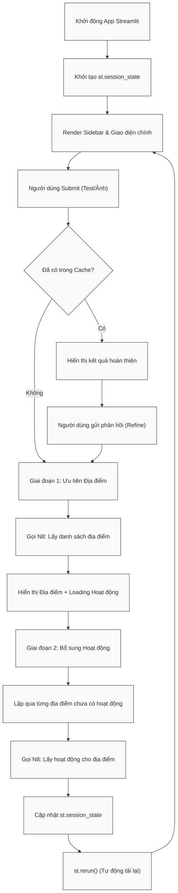

# Module N7: Giao diện Streamlit

**Dự án:** Travel Experience Planner  
**Ngày:** 2026-05-15

---

## 1. Vai trò của Module N7

N7 là lớp tiếp xúc trực tiếp với người dùng. Nếu các module phía backend là nơi “hiểu” và “tính toán”, thì N7 là nơi chuyển toàn bộ năng lực đó thành một trải nghiệm tương tác mạch lạc, dễ hiểu và đủ hấp dẫn để người dùng thật sự muốn khám phá kết quả.

Trong bài toán recommendation du lịch, giao diện không chỉ để nhập liệu và hiển thị output. Nó còn phải giải quyết ba vấn đề lớn:

- người dùng có nhiều cách mô tả nhu cầu khác nhau
- kết quả không chỉ là danh sách mà là một hành trình khám phá
- hệ thống cần hỗ trợ các vòng tinh chỉnh (feedback loop)

Do đó, N7 được thiết kế như một UI có state rõ ràng, thay vì chỉ là một form gửi request.

---

## 2. Tư tưởng thiết kế giao diện

N7 được xây dựng trên Streamlit, nhưng không dùng theo kiểu “prototype thô”. Module này cố gắng biến Streamlit thành một lớp UI có:

- luồng trạng thái rõ ràng
- phân tách view hợp lý
- tương tác phản hồi nhanh

### 2.1. Vì sao chọn Streamlit?

Streamlit phù hợp với dự án vì:

- tốc độ triển khai nhanh
- rất thuận tiện cho ứng dụng AI/data-driven
- dễ tích hợp với Python backend hiện có

Tuy nhiên, điểm yếu tự nhiên của Streamlit là dễ bị “trang demo kỹ thuật” nếu không tổ chức state và layout cẩn thận. N7 vì vậy bổ sung:

- CSS tùy biến
- session state
- phân tách `views/`, `styles/`, `state.py`

để đưa trải nghiệm lên gần hơn với một ứng dụng thật.

---

## 3. Điểm vào và cấu trúc module

Điểm vào của N7 là:

```python
app.py
```

Cấu trúc chính gồm:

- `app.py`: điều phối luồng giao diện
- `state.py`: khởi tạo session state
- `styles/`: CSS và các thành phần trình bày
- `views/header/`: vùng tiêu đề
- `views/input/`: các phương thức nhập liệu
- `views/result/`: hiển thị kết quả và feedback

Thiết kế này giúp giao diện có tính module hóa nội bộ, thay vì dồn toàn bộ logic UI vào một file duy nhất.

---

## 4. Các phương thức nhập liệu

N7 hỗ trợ nhiều cách người dùng mô tả ý định du lịch:

- **Trắc nghiệm:** thu thập preference có cấu trúc
- **Văn bản tự do:** cho phép mô tả tự nhiên
- **Hình ảnh:** hỗ trợ tín hiệu cảm hứng thị giác

### 4.1. Ý nghĩa của multi-input UI

Đây không chỉ là tính năng tiện lợi. Nó phản ánh một tư duy rất quan trọng của hệ thống:

- không ép người dùng phải “nói đúng kiểu máy hiểu”
- cho phép nhiều dạng biểu đạt cùng hội tụ về một semantic pipeline thống nhất

N7 chính là nơi nối giữa:

- ngôn ngữ con người
- biểu đạt cảm tính
- cấu trúc dữ liệu mà backend cần

---

## 5. Luồng trạng thái của ứng dụng

N7 hiện vận hành theo ba pha chính:

1. **Input mode:** người dùng nhập dữ liệu
2. **Pending request:** hệ thống đang gửi request và chờ phản hồi
3. **Result mode:** hiển thị kết quả đã có

Các session keys quan trọng gồm:

- `mode`
- `payload`
- `results`
- `activity_results`

### 5.1. Vì sao Session State quan trọng?

Trong Streamlit, mỗi lần rerun có thể xem như render lại toàn bộ ứng dụng. Nếu không dùng session state cẩn thận:

- người dùng dễ mất dữ liệu đang nhập
- kết quả vừa tải xong có thể biến mất
- feedback loop rất khó thực hiện mượt mà

Do đó, session state là nền tảng giúp N7 hoạt động như một ứng dụng có bộ nhớ phiên, chứ không phải một trang chạy script tuyến tính.

---

## 6. Luồng gọi API

### 6.1. Gợi ý địa điểm

Khi người dùng submit đầu vào, N7 gửi `POST` tới:

```text
http://localhost:{API_PORT}/recommend
```

với:

- JSON body từ input view
- header `X-Internal-Key`
- timeout đủ dài để chờ backend hoàn tất pipeline

### 6.2. Gợi ý hoạt động

Sau khi có danh sách địa điểm, result view tiếp tục gửi request:

```text
http://localhost:{API_PORT}/activities
```

cho từng địa điểm.

### 6.3. Feedback loop

N7 còn gửi feedback qua:

- `/feedback/recommend`
- `/feedback/activities`

Điều này biến giao diện từ một hệ thống “truy vấn một lần” thành một giao diện có thể đối thoại và tinh chỉnh dần.

---

## 7. Chiến lược hiển thị kết quả

Một quyết định UX quan trọng trong N7 là **render địa điểm trước, tải hoạt động sau**.



### 7.1. Vì sao không chờ toàn bộ hoạt động xong mới hiển thị?

Nếu đợi cả hai tầng kết quả xong hết mới render:

- cảm giác phản hồi sẽ chậm
- người dùng không thấy tiến trình rõ ràng
- trải nghiệm AI có thể bị hiểu là “đơ”

Ngược lại, render địa điểm trước giúp:

- người dùng thấy hệ thống đã hiểu truy vấn
- thời gian chờ được chia nhỏ hợp lý
- skeleton loaders cho hoạt động tạo cảm giác đang tiếp tục xử lý

Đây là một lựa chọn rất đáng giá về UX, ngay cả khi backend vẫn xử lý tuần tự ở một số chỗ.

---

## 8. Cơ chế feedback tại UI

N7 hỗ trợ hai cấp feedback:

- **feedback toàn cục:** tinh chỉnh lại toàn bộ lộ trình
- **feedback theo địa điểm:** tinh chỉnh danh sách hoạt động cho một nơi cụ thể

### 8.1. Ý nghĩa của thiết kế này

Người dùng thực tế thường không muốn “làm lại từ đầu”, mà muốn:

- giữ phần đúng
- sửa phần chưa hợp

N7 vì vậy được thiết kế để:

- giữ state hiện có
- gửi phần phản hồi tối thiểu cần thiết
- thay thế kết quả tương ứng sau khi backend xử lý xong

Đây là bước làm cho toàn hệ thống gần hơn với trải nghiệm assistant thay vì search engine thuần túy.

---

## 9. Ghi chú vận hành

- khi backend trả `200 OK`, JSON response được lưu vào session state
- khi backend trả lỗi HTTP, UI hiển thị lỗi từ server
- khi request thất bại hoàn toàn, UI hiển thị lỗi kết nối
- nếu mở result view mà chưa có data, N7 hiển thị trạng thái hướng dẫn quay lại

---

## 10. Kết luận

N7 không chỉ là lớp “trang trí” cho backend. Nó là phần chuyển hóa pipeline AI thành trải nghiệm có thể sử dụng được bởi con người. Giá trị lớn nhất của module này nằm ở:

- hỗ trợ multi-input
- quản lý state tốt
- render kết quả theo từng tầng
- tích hợp feedback loop mượt mà

Đây là một phần rất quan trọng để biến hệ thống recommendation từ một bài toán kỹ thuật thành một ứng dụng hoàn chỉnh.

---

## 11. Tài liệu tham khảo

| # | Chủ đề | Nguồn tham khảo |
|---|---|---|
| 1 | Streamlit Documentation | [docs.streamlit.io](https://docs.streamlit.io/) |
| 2 | Requests Documentation | [requests.readthedocs.io](https://requests.readthedocs.io/) |
