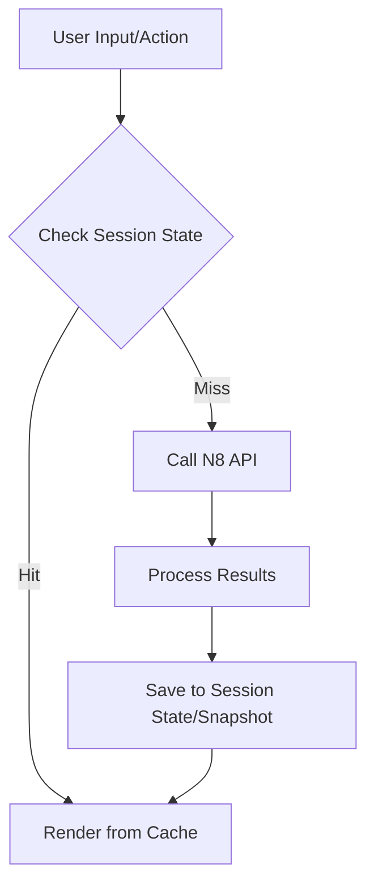

# Module N7: Giao diện người dùng (Frontend UI)

**Dự án:** Travel Experience Planner  
**Ngày:** 2026-05-14

---

## 1. Vai trò của Module N7

N7 là lớp giao tiếp trực tiếp với người dùng. Nó được thiết kế để chuyển đổi những nhu cầu du lịch trừu tượng thành các tương tác trực quan, giúp người dùng dễ dàng khám phá và lên kế hoạch cho chuyến đi.

---

## 2. Công nghệ và Kiến trúc UI

Module N7 được xây dựng trên nền tảng **Streamlit**, nhưng được tùy biến sâu để đạt được trải nghiệm người dùng cao cấp:

-   **Thiết kế (Theming):** Sử dụng bộ nhận diện thương hiệu màu Đỏ chủ đạo (`#ff6b6b`), kết hợp Dark Mode và font chữ hiện đại (Be Vietnam Pro).
-   **Xử lý song song (Concurrency):** Sử dụng `ThreadPoolExecutor` để gọi API sinh hoạt động cho nhiều địa điểm cùng lúc. Điều này giúp giao diện không bị treo khi chờ đợi LLM xử lý.
-   **Trạng thái (State Management):** Cơ chế "Snapshot" giúp lưu giữ thông tin người dùng nhập qua lại giữa các tab (Trắc nghiệm, Văn bản, Hình ảnh) mà không bị mất dữ liệu.

---

## 3. Các Tính năng và Thành phần

### 3.1. Hệ thống Nhập liệu Đa phương thức (Input View)
-   **📋 Trắc nghiệm (Questionnaire):** Hệ thống câu hỏi trực quan để tự động trích xuất bộ thẻ (tags) sở thích.
-   **✍️ Văn bản tự do (Freeform):** Cho phép người dùng nhập liệu tự nhiên.
-   **📸 Hình ảnh (Image Upload):** Hỗ trợ tải ảnh để tìm kiếm theo cảm hứng thị giác.

### 3.2. Hiển thị Kết quả (Result View)
-   **Layout 2 cột (5:4):**
    -   **Bên trái:** Thẻ địa điểm (Location Card) với thanh điểm Match Score (0-100%) và hình ảnh lớn.
    -   **Bên phải:** Danh sách hoạt động (Activity List).
-   **Skeleton Loaders:** Hiển thị trạng thái chờ (shimmer effect) trong khi AI đang sinh hoạt động, tạo cảm giác mượt mà và phản hồi tức thì.
-   **💡 Insight:** Hiển thị lý do gợi ý (Reasoning) cho cả địa điểm và từng hoạt động cụ thể.

---

## 4. State Caching & Hiệu năng

N7 sử dụng cơ chế **State Caching** mạnh mẽ của Streamlit để bảo toàn trải nghiệm và tối ưu tốc độ phản hồi:

-   **Session State (State Caching):** Lưu trữ toàn bộ dữ liệu đầu vào (Snapshots) và kết quả tìm kiếm trong phiên làm việc. Điều này giúp người dùng có thể quay lại xem kết quả cũ mà không cần gọi lại Backend.
-   **`st.cache_resource`:** Sử dụng để cache các tài nguyên tĩnh như CSS, cấu hình kết nối, giúp giảm thời gian khởi tạo UI.
-   **Parallel Fetching:** Sử dụng `ThreadPoolExecutor` để gọi API sinh hoạt động song song cho nhiều địa điểm, kết hợp với Skeleton Loaders để duy trì tính tương tác của giao diện.

---

## 5. Luồng xử lý kỹ thuật (Technical Flow)

1.  **Aggregation:** Tổng hợp dữ liệu từ 3 nguồn nhập liệu thành một payload duy nhất.
2.  **Routing:** Chuyển từ `mode: Input` sang `mode: Result` và kích hoạt hiệu ứng Spinner.
3.  **Concurrent Fetch:** 
    - Gọi API `/recommend` để lấy danh sách Top-5 địa điểm.
    - Kích hoạt song song các luồng (workers) để gọi API `/activities` cho từng địa điểm ngay khi danh sách địa điểm xuất hiện.
4.  **Enrichment:** Hiển thị thông tin về Provider (Groq/Gemini) và trạng thái Cache (nếu có) trên từng thẻ hoạt động.

---

## 6. Tài liệu tham khảo

| # | Chủ đề | Nguồn tham khảo |
|---|---|---|
| 1 | Streamlit — Documentation & Gallery | [docs.streamlit.io](https://docs.streamlit.io/) |
| 2 | Python Concurrent — ThreadPoolExecutor | [docs.python.org/library/concurrent.futures](https://docs.python.org/3/library/concurrent.futures.html) |
| 3 | Google Fonts — Be Vietnam Pro | [fonts.google.com/specimen/Be+Vietnam+Pro](https://fonts.google.com/specimen/Be+Vietnam+Pro) |
