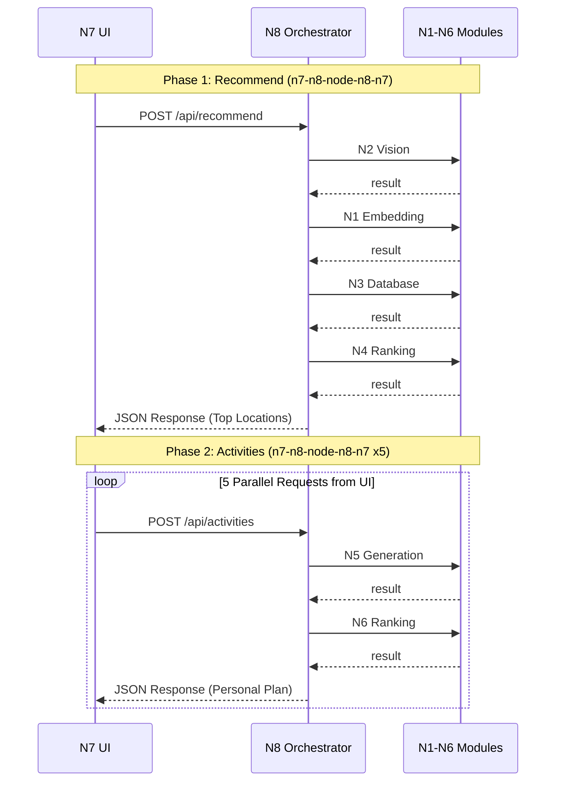
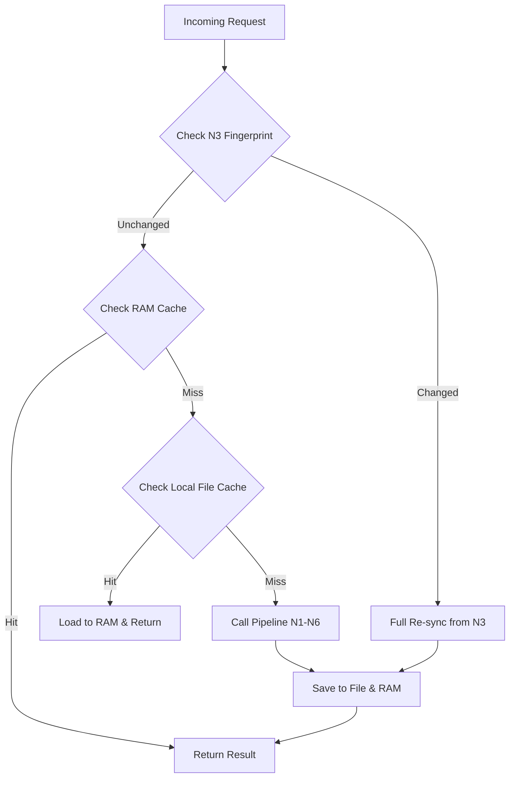

# Module N8: Điều phối và API (Orchestrator)

**Dự án:** Travel Experience Planner  
**Ngày:** 2026-05-14  

---

## 1. Vai trò của Module N8

N8 là trung tâm điều khiển của toàn bộ hệ thống. Nó chịu trách nhiệm nhận yêu cầu từ người dùng, gọi các module chuyên biệt (N1-N6) theo đúng thứ tự, xử lý dữ liệu trung gian và trả về kết quả cuối cùng.

N8 đảm bảo rằng các module không cần biết về sự tồn tại của nhau, giữ cho hệ thống luôn linh hoạt (decoupled).

---

## 2. Các Dịch vụ Chính (Services)

### 2.1. Gợi ý Địa điểm (Recommend Service)
-   **Nhiệm vụ:** Tìm và xếp hạng các địa điểm phù hợp nhất.
-   **Luồng xử lý:** `N2 (Vision)` -> `N1 (User Embedding)` -> `N3 (DB Fetch)` -> `N4 (Ranking)`.

### 2.2. Khám phá Hoạt động (Activities Service)
-   **Nhiệm vụ:** Sinh và xếp hạng hoạt động cho một địa điểm cụ thể.
-   **Luồng xử lý:** `N5 (Generation)` -> `N1 (Activity Embedding)` -> `N6 (Ranking)`.

---

## 3. Sơ đồ Trình tự Xử lý (Sequence Diagram)

Hệ thống hoạt động theo mô hình Hub-and-Spoke với N8 là trung tâm. Dữ liệu luôn quay về N8 trước khi chuyển sang module tiếp theo:

---

## 4. Giao diện API (Endpoints)

| Endpoint | Method | Chức năng |
|----------|--------|-----------|
| `/api/recommend` | POST | Nhận text, tags, image và trả về danh sách địa điểm. |
| `/api/activities` | POST | Nhận ID địa điểm và trả về danh sách hoạt động cá nhân hóa. |

---

## 4. Chiến lược Điều phối: "Parallel Frontend, Sequential Backend"

Một điểm đặc biệt trong kiến trúc của N8 là sự kết hợp giữa **N7 (Song song)** và **N8 (Tuần tự)**:

-   **Tại Frontend (N7):** Sử dụng đa luồng để gọi đồng thời 5 yêu cầu sinh hoạt động. Điều này giúp UI hiển thị các Skeleton loaders ngay lập tức, tạo cảm giác mượt mà.
-   **Tại Backend (N8 - Flask):** Mặc dù nhận yêu cầu song song, Flask được xử lý tuần tự (synchronous). 

### Tại sao lại chọn Flask thay vì FastAPI?
Trong dự án này, việc **Flask chậm hơn FastAPI lại là một lợi thế chiến lược**:
1.  **Bottleneck tại N5:** Module N5 gọi tới các LLM API (Groq) có giới hạn Rate Limit cực kỳ nghiêm ngặt (TPM/RPM). 
2.  **Cơ chế Hàng đợi tự nhiên (Natural Queueing):** Nếu sử dụng FastAPI với cơ chế xử lý bất đồng bộ hoàn toàn, 5 yêu cầu từ N7 sẽ "tấn công" Groq cùng một lúc, dẫn đến lỗi `429 Too Many Requests`. 
3.  **Tự động điều tiết (Throttling):** Flask đóng vai trò như một bộ điều tiết tự nhiên. Nó xếp hàng các yêu cầu và xử lý từng cái một, giúp các đợt gọi API vào N5 được trải dài theo thời gian, vừa vặn với tốc độ xử lý của LLM mà không cần cài đặt các hệ thống hàng đợi phức tạp như Celery hay Redis.

---

## 5. Chiến lược Caching: Distributed Hybrid Caching

N8 triển khai một hệ thống cache đa tầng nhằm giảm thiểu độ trễ và giảm tải cho Database (N3) cũng như các API bên ngoài:

-   **RAM Cache:** Lưu trữ metadata địa điểm để truy xuất tức thì trong miliseconds.
-   **Local File Cache (`location_cache.json`):** Lưu trữ dữ liệu bền vững, giúp hệ thống khởi động nhanh mà không cần fetch lại toàn bộ từ Database.
-   **Distributed Image Persistence:** Tự quản lý thư mục `image_cache/`. Ảnh được lấy từ N3 (Base64) và lưu thành file cục bộ, mô phỏng một CDN thu nhỏ.
-   **Smart Fingerprint Check:** Trước mỗi yêu cầu, N8 thực hiện một truy vấn siêu nhẹ tới N3 để lấy mã băm dữ liệu. Nếu mã băm không đổi, N8 hoàn toàn tin tưởng vào cache nội bộ.
-   **Cơ chế Invalidation (Làm mới):**
    -   *Manual Trigger:* Endpoint `/api/cache/reset` ép buộc nạp lại dữ liệu.
    -   *Startup Flag:* Tùy chọn `--refresh` khi khởi động.
-   **Error Handling:** Nếu một module gặp lỗi, N8 sẽ bỏ qua và tiếp tục pipeline để đảm bảo luôn có kết quả trả về.
-   **Debug Trace:** Cung cấp "dấu vết" xử lý chi tiết của từng module khi bật `API_DEBUG`.
---

## 6. Tài liệu tham khảo

| # | Chủ đề | Nguồn tham khảo |
|---|---|---|
| 1 | Flask — Tiêu chuẩn cho micro-services đồng bộ | [flask.palletsprojects.com](https://flask.palletsprojects.com/) |
| 2 | Python Requests — Thư viện gọi API HTTP | [requests.readthedocs.io](https://requests.readthedocs.io/) |
| 3 | Flask vs FastAPI — So sánh Sync và Async (Lợi thế của tuần tự) | [marketcalls.in](https://www.marketcalls.in/python/flask-vs-fastapi-sync-and-async-comparison-in-fintech-applications-python-tutorial.html) |
