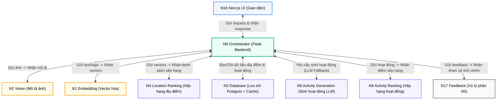
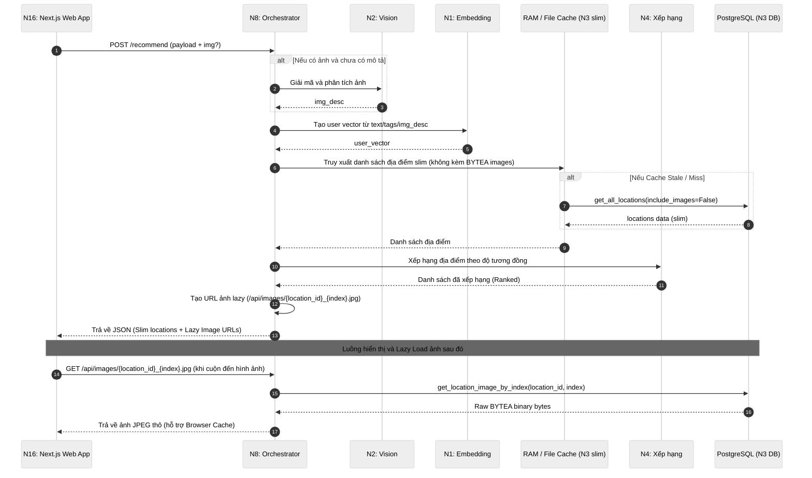
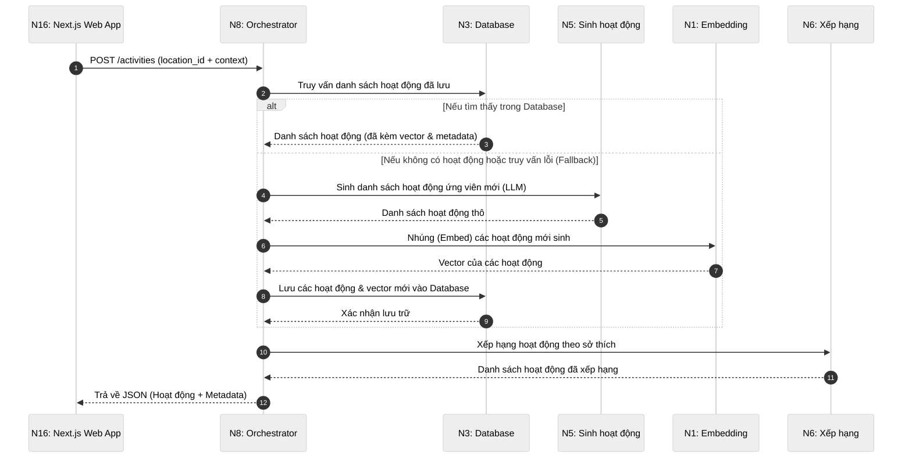
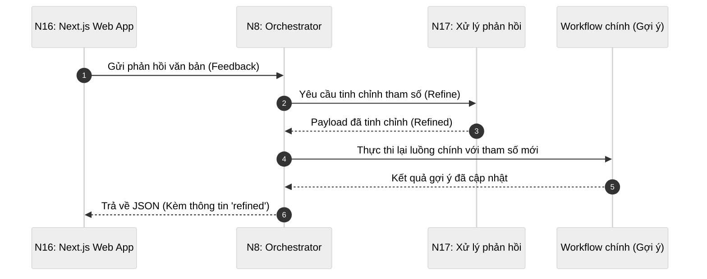
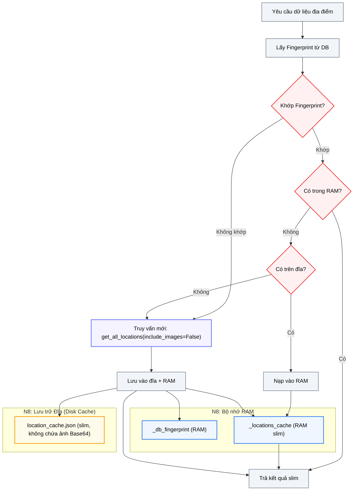
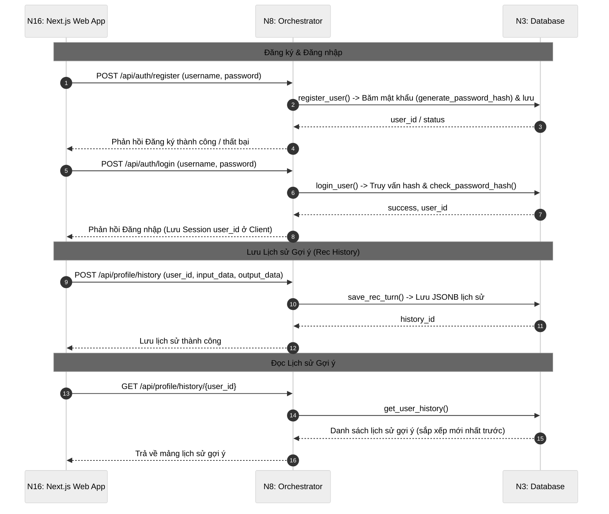

# Module N8: Điều phối API

**Dự án:** Travel Experience Planner  
**Ngày:** 2026-05-15

---

## 1. Vai trò của Module N8

N8 là trung tâm điều phối của hệ thống. Đây là nơi mọi request từ frontend đi vào, nơi các workflow được lắp ghép đúng thứ tự, và cũng là nơi xử lý các concern vận hành như bảo vệ route, cache, enrich response và debug trace.

Nếu mô tả hệ thống theo ngôn ngữ kiến trúc, N8 đóng vai trò **application coordinator**. Nó không thay thế các module chuyên môn, mà giữ cho:

- dữ liệu đi đúng đường
- output của module này phù hợp với input của module kia
- phản hồi cuối cùng phù hợp với nhu cầu của UI

Đây là lớp làm cho toàn bộ hệ thống module hóa có thể hoạt động trơn tru như một ứng dụng thống nhất.

---

## 2. Chiến lược kiến trúc: Tại sao chọn Flask & Synchronous?

Một câu hỏi kiến trúc thường gặp là tại sao không dùng FastAPI để tận dụng tính bất đồng bộ (async). Tuy nhiên, với đặc thù dự án này, Flask và cơ chế Synchronous là lựa chọn tối ưu hơn vì:

1.  **Kiểm soát Rate Limit (Tránh lỗi 429)**: Vì hệ thống sử dụng các mô hình AI ở tầng miễn phí (Free Tier như Groq), việc xử lý đồng thời (async/parallel) sẽ cực kỳ dễ dẫn đến nghẽn cổ chai và lỗi 429 (Too Many Requests). Cơ chế synchronous đóng vai trò như một "bộ điều tiết tự nhiên", đảm bảo các yêu cầu được gửi đi theo hàng đợi tuần tự, tối đa hóa tỷ lệ thành công của các module như N5.
2.  **Bản chất tuần tự của AI Pipeline**: Các bước xử lý (Vision → Embedding → Ranking) bắt buộc phải chạy tuần tự vì bước sau cần kết quả của bước trước. Việc dùng `async` không mang lại lợi ích về tốc độ trong luồng tính toán đơn lẻ này.
3.  **Đơn giản hóa Debug**: Debug các module AI (như Groq API calls hoặc vector operations) trong môi trường synchronous dễ dàng và tin cậy hơn nhiều so với việc quản lý loop của `asyncio`.
4.  **Tương thích Deployment**: Flask có cộng đồng hỗ trợ cực lớn và tương thích hoàn hảo với các môi trường deployment đơn giản (như Hugging Face Spaces hoặc các server CPU-bound) mà không cần cấu hình worker phức tạp.
5.  **Tối ưu cho Streamlit**: Frontend Streamlit vốn dĩ vận hành theo cơ chế script-rerun (tuần tự). Việc giữ backend đồng nhất về tư duy synchronous giúp toàn bộ hệ thống dễ bảo trì hơn.

---

## 3. Vì sao cần một lớp điều phối riêng?

Về lý thuyết, frontend có thể gọi trực tiếp từng module backend hoặc tự gắn pipeline bằng nhiều request nhỏ. Tuy nhiên, cách đó gây ra nhiều vấn đề:

- frontend phải biết chi tiết nội bộ của từng module
- contract giữa các module trở nên rò rỉ ra ngoài
- khó kiểm soát cache, logging và bảo mật

N8 giải quyết các vấn đề đó bằng cách gom toàn bộ orchestration vào một nơi duy nhất. Nhờ vậy:

- frontend chỉ cần biết một số endpoint ổn định
- các module chuyên môn có thể tiến hóa độc lập hơn
- các concern hệ thống được tập trung hóa

### 3.1. Sơ đồ tương tác hệ thống (Orchestrator Coordination Flow)

Dưới đây là sơ đồ thể hiện vai trò trung tâm của **N8: Orchestrator**, đóng vai trò làm cổng kết nối duy nhất và điều phối dòng dữ liệu giữa **N16: Next.js UI** với tất cả các module xử lý nghiệp vụ chuyên biệt (không bao gồm N7):



---

## 4. Điểm vào và cấu trúc module

Điểm vào của N8 là:

```python
app.py
```

Các thành phần chính:

- `app.py`: khởi tạo Flask app và CORS
- `routes.py`: định nghĩa endpoint và request guard
- `services.py`: orchestration logic
- `utils.py`: helper parse JSON và error response

Thiết kế này cho thấy N8 không chỉ là một file Flask đơn lẻ, mà là một module backend hoàn chỉnh với phân tách trách nhiệm rõ ràng.

---

## 5. Các endpoint công khai

| Endpoint | Method | Chức năng |
|---|---|---|
| `/health` | GET | Kiểm tra trạng thái runtime |
| `/recommend` | POST | Chạy workflow gợi ý địa điểm |
| `/activities` | POST | Sinh và xếp hạng hoạt động cho một địa điểm |
| `/cache/reset` | POST | Ép làm mới cache địa điểm |
| `/cache/fingerprint` | GET | Lấy fingerprint dữ liệu hiện tại |
| `/feedback/recommend` | POST | Tinh chỉnh lại workflow gợi ý địa điểm |
| `/feedback/activities` | POST | Tinh chỉnh lại workflow hoạt động |

### 4.1. Ý nghĩa của bộ endpoint này

Điều đáng chú ý là N8 không expose toàn bộ module thành endpoint riêng lẻ. Thay vào đó, nó expose các **use-case cấp sản phẩm**:

- recommend
- activities
- feedback
- health
- cache management

Đây là cách thiết kế API đúng hướng application-level thay vì module-level.

---

## 6. Bảo vệ request và kiểm tra input

Các route nội bộ yêu cầu:

```text
X-Internal-Key
```

Nếu thiếu hoặc sai key, request bị từ chối với mã `401`.

Ngoài ra, từng endpoint còn có rule kiểm tra riêng:

- `/recommend`: cần ít nhất `text` hoặc `tags`
- `/activities`: cần `location`
- hai endpoint feedback: cần `feedback`

### 6.1. Vì sao điều này quan trọng?

N8 là biên giới giữa UI và logic nghiệp vụ. Nếu lớp này không kiểm tra request cẩn thận:

- **Bảo mật**: Ngăn chặn các truy cập trái phép không đến từ frontend được chỉ định (thông qua `X-Internal-Key`).
- **Tính ổn định**: Tránh việc các tham số rác hoặc thiếu hụt gây lỗi lan truyền sâu vào pipeline AI.
- **Khả năng quan sát**: Giúp debug đúng điểm hỏng và giảm nhiễu log ở các lớp dưới.
- **Bảo vệ tài nguyên**: Rủi ro lộ các route nội bộ hoặc lãng phí token LLM vào các request không hợp lệ được giảm thiểu tối đa.

Việc chặn sớm ở N8 giúp toàn hệ thống ổn định và bảo mật hơn.

---

## 7. Workflow gợi ý địa điểm

Workflow `recommend_service()` hiện gồm các bước lớn:

1. đọc `text`, `tags`, `image`, `constraints`, `context`
2. nếu cần thì chuyển ảnh Base64 sang `img_desc`
3. nhúng phía người dùng
4. lấy dữ liệu địa điểm từ cache hoặc từ tầng dữ liệu
5. ánh xạ dữ liệu sang contract ranking
6. chạy xếp hạng địa điểm
7. enrich thêm ảnh, metadata và geo cho response cuối



### 6.1. Điểm mạnh của workflow này

Workflow được tổ chức theo đúng tinh thần “semantic first, enrichment later”:

- trước hết lấy ranking score
- sau đó mới gắn dữ liệu trình bày như ảnh và metadata

Điều này giúp logic xếp hạng giữ được sự sạch sẽ, còn UI vẫn nhận được response giàu thông tin.

---

## 8. Workflow sinh hoạt động

Workflow `activities_service()` thực hiện:

1. nhận bối cảnh người dùng và một địa điểm cụ thể
2. truy vấn danh sách hoạt động ứng viên và vector từ Database (N3)
3. nếu không tồn tại hoặc lỗi, fallback sang gọi N5 để sinh mới qua LLM, nhúng vector bằng N1 và lưu trữ kết quả vào N3
4. xếp hạng danh sách hoạt động dựa trên sở thích bằng N6
5. enrich metadata và trả về kết quả cho UI


### 7.1. Vai trò của N8 trong việc tối ưu hóa và fallback sinh hoạt động

Đây là một điểm thiết kế quan trọng:

- **Tối ưu hóa tài nguyên:** N8 luôn ưu tiên lấy dữ liệu hoạt động đã lưu kèm vector sẵn từ Database (N3). Điều này giảm thiểu thời gian chờ đợi (latency) và chi phí API đáng kể so với việc liên tục sinh mới.
- **Cơ chế Fallback & Nhúng động:** Chỉ khi không tìm thấy dữ liệu trong Database, N8 mới gọi N5 để sinh hoạt động qua LLM. Lúc này, do hoạt động mới sinh chưa có vector, N8 đóng vai trò "bắc cầu" gọi N1 để nhúng các hoạt động này, sau đó lưu toàn bộ vào N3 để phục vụ cho các yêu cầu sau.

---

## 9. Workflow feedback

N8 có hai workflow feedback:

- feedback cho gợi ý địa điểm
- feedback cho gợi ý hoạt động

Trong cả hai trường hợp, pattern đều giống nhau:

1. nhận phản hồi mới
2. tinh chỉnh lại đầu vào hiện tại
3. chạy lại workflow chính
4. đính kèm payload `refined` vào response

### 8.1. Ý nghĩa của cách làm này

Thay vì bắt frontend tự tự chỉnh input rồi gửi lại từ đầu, N8 để quá trình refine diễn ra ở backend. Điều này giúp:

- UI đơn giản hơn
- logic refine tập trung hơn
- hệ thống có thể giải thích được cụ thể điều gì đã được thay đổi


---

## 10. Chiến lược cache nhiều tầng

Một trong những điểm đáng giá nhất của N8 là hệ thống cache lai:

1. **RAM cache**
2. **Disk cache** qua `location_cache.json`
3. **Image cache** qua thư mục `image_cache/`



### 9.1. Vì sao cần fingerprint?

N8 không muốn nạp lại toàn bộ dữ liệu địa điểm ở mọi request. Nhưng nếu chỉ tin tuyệt đối vào cache, dữ liệu sẽ dễ stale. Fingerprint là cách cân bằng:

- chi phí kiểm tra rất thấp
- đủ để biết dữ liệu đã thay đổi hay chưa

Đây là một thiết kế rất thực tế và có giá trị báo cáo cao vì nó thể hiện tư duy đồng bộ incremental thay vì reload thô.

### 9.2. Vì sao ảnh được cache thành file cục bộ?

Ảnh Base64 rất nặng nếu giữ lâu trong RAM hoặc JSON cache. Việc tách ảnh ra thành file JPEG cục bộ giúp:

- giảm kích thước cache JSON
- giảm áp lực bộ nhớ
- vẫn cho phép rehydrate dữ liệu ảnh khi cần render

Đây là một kiểu “mini asset persistence layer” rất đáng chú ý trong quy mô dự án này.

---

## 11. Hình dạng response

Tùy endpoint, response của N8 có thể chứa:

- `locations`
- `activities`
- `metadata`
- `meta`
- `ranking_meta`
- `trace`
- `refined`

### 10.1. Ý nghĩa của `trace`

Khi bật debug runtime, response gợi ý địa điểm có thể kèm `trace`. Đây là một quyết định rất tốt cho:

- benchmark
- giải thích pipeline
- viết báo cáo
- debug sai lệch semantic

Nó giúp người phát triển quan sát được:

- input gốc
- `img_desc`
- tín hiệu `text_k`, `tags_k`
- preprocessed text
- vector dimensions
- weights được dùng trong ranking

---

## 12. Ghi chú vận hành

- Flask app bật CORS theo danh sách origin cấu hình
- routes được đăng ký bằng blueprint
- module ghi log ở mức service loading, cache hit/miss và runtime execution
- host, port, debug mode và internal key đều lấy từ cấu hình dự án

---

## 12. Luồng Authentication và Lưu Lịch sử (Auth & Rec History)

N8 bổ sung phân khu routes người dùng chuyên biệt để bảo vệ tài khoản và ghi nhận lịch sử khuyến nghị:



---

## 13. Kết luận

N8 là lớp biến các module rời rạc thành một ứng dụng thực thụ. Giá trị lớn nhất của nó không nằm ở một thuật toán đơn lẻ, mà ở khả năng:

- nối contract dữ liệu giữa các module
- bảo vệ và kiểm soát request
- tối ưu cache
- enrich response cho frontend
- hỗ trợ feedback loop

Đây là một ví dụ rất rõ của tư duy kiến trúc ứng dụng: cùng một hệ thống AI chỉ thực sự hữu dụng khi có một lớp điều phối đủ tốt để biến các thành phần chuyên môn thành một sản phẩm hoàn chỉnh.

---

## 14. Tài liệu tham khảo

| # | Chủ đề | Nguồn tham khảo |
|---|---|---|
| 1 | Flask Documentation | [flask.palletsprojects.com](https://flask.palletsprojects.com/) |
| 2 | Flask-CORS | [flask-cors.readthedocs.io](https://flask-cors.readthedocs.io/) |
| 3 | Requests Documentation | [requests.readthedocs.io](https://requests.readthedocs.io/) |
