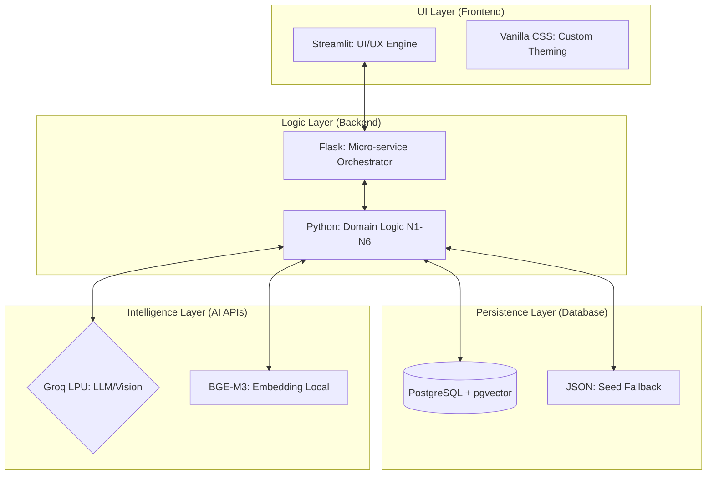

# Lý Do Lựa Chọn Công Nghệ

**Dự án:** Travel Experience Planner  
**Ngày:** 2026-05-14  

---

## 0. Tổng quan Hệ sinh thái (Ecosystem Overview)

Hệ thống được xây dựng trên một ngăn xếp công nghệ hiện đại, tập trung vào tốc độ xử lý (Inference Speed) và tính linh hoạt của dữ liệu (Data Portability).



---

## 1. Groq thay vì OpenAI / Google Gemini

### Vấn đề với các lựa chọn thay thế

| Tiêu chí | OpenAI API | Google Gemini | **Groq** |
|----------|-----------|--------------|----------|
| Tốc độ inference | ~1–3 tok/s (streaming) | ~1–2 tok/s | **~300–500 tok/s** |
| Free tier | Rất hạn chế | Có, nhưng quota thấp | **Rộng rãi (30K TPM/model)** |
| Số model có sẵn | Ít (GPT-4o, GPT-4...) | Ít (Gemini Pro, Flash) | **7+ model đang dùng** |
| Khả năng failover | Không (1 model/call) | Không | **Có — multi-model chain** |
| JSON mode | Có | Có | **Có (`response_format`)** |
| Chi phí production | Cao | Trung bình | **Thấp hơn đáng kể** |

### Lý do chọn Groq

**1. Tốc độ vượt trội (LPU architecture):**  
Groq sử dụng chip LPU (Language Processing Unit) chuyên biệt cho inference, đạt tốc độ cao hơn GPU thông thường 10–20 lần. Với pipeline N5 cần sinh 10 activities/địa điểm, độ trễ thấp là yêu cầu thiết yếu cho trải nghiệm real-time.

**2. Multi-model failover chain:**  
Thay vì phụ thuộc vào một model duy nhất, hệ thống triển khai một chuỗi 7 model theo thứ tự chất lượng giảm dần:

```
gpt_120b → groq_70b → qwen_32b → groq_8b → gpt_20b → gpt_safeguard → groq_scout
```

Khi model ưu tiên cao bị rate-limit hoặc lỗi, hệ thống **tự động chuyển sang model tiếp theo** mà không cần can thiệp thủ công. OpenAI và Gemini không cung cấp cơ chế tương đương trên cùng một API key.

**3. Free tier đủ rộng cho production nhỏ:**  
Groq cung cấp quota miễn phí lên đến 30K TPM (tokens per minute) cho model Scout — đủ để xử lý toàn bộ pipeline cho một lượng người dùng đồng thời vừa phải mà không phát sinh chi phí.

**4. JSON mode đảm bảo tính toàn vẹn output:**  
Groq hỗ trợ `response_format: {"type": "json_object"}` — ép buộc model chỉ sinh ra JSON hợp lệ ở cấp độ token sampling. Điều này kết hợp với cơ chế Auto-Repair parser tạo thành hệ thống phòng thủ 3 lớp cho N5.

---

## 2. PostgreSQL + pgvector thay vì Pinecone / Weaviate

### Vấn đề với Vector Database chuyên dụng

| Tiêu chí | Pinecone | Weaviate | **PostgreSQL + pgvector** |
|----------|---------|---------|--------------------------|
| Self-hosted | ✗ (cloud-only) | ✓ (phức tạp) | **✓ (đơn giản)** |
| SQL queries song song | ✗ | ✗ | **✓ (native JOIN, WHERE)** |
| Vendor lock-in | Cao | Trung bình | **Không** |
| Free tier | Rất hạn chế | Có | **Không giới hạn (self-host)** |
| Tích hợp với dữ liệu quan hệ | Khó | Khó | **Tự nhiên** |
| Độ phức tạp vận hành | Thấp (managed) | Cao | **Thấp (familiar tooling)** |

### Lý do chọn pgvector

**1. Không vendor lock-in:**  
Pinecone là dịch vụ cloud độc quyền — nếu pricing thay đổi hoặc dịch vụ ngừng hoạt động, toàn bộ dữ liệu vector bị ảnh hưởng. PostgreSQL là open-source, có thể self-host trên bất kỳ nền tảng nào (Supabase, Railway, VPS, local).

**2. Dữ liệu quan hệ và vector trong cùng một database:**  
Pipeline cần lưu trữ cả metadata (tên địa điểm, tags, tọa độ GPS) lẫn vector embeddings. Với pgvector, một bản ghi location chứa tất cả trong một bảng SQL duy nhất — không cần đồng bộ giữa hai hệ thống riêng biệt:

```sql
CREATE TABLE locations (
    location_id VARCHAR(255) PRIMARY KEY,
    text        vector(1024),   -- semantic embedding
    aug_text    vector(1024),   -- augmented text embedding
    aug_tags    vector(1024),   -- tag embedding
    img_desc    vector(1024),   -- vision embedding
    metadata    JSONB,          -- name, description, tags
    geo         JSONB           -- lat, lng
);
```

**3. Fallback JSON đơn giản:**  
Khi DB không khả dụng (môi trường dev/staging), `get_all_locations()` tự động đọc từ `seeds/locations_with_vectors.json`. Cơ chế này không thể thực hiện dễ dàng với Pinecone hay Weaviate.

**4. Cosine similarity native với pgvector:**  
Extension pgvector cung cấp toán tử `<=>` cho cosine distance trực tiếp trong SQL — không cần tải toàn bộ vectors về Python để tính.

---

## 3. Cosine Similarity thay vì Dot Product

### So sánh toán học

| | Dot Product | **Cosine Similarity** |
|--|------------|----------------------|
| Công thức | `a · b = Σ(aᵢ × bᵢ)` | `(a · b) / (‖a‖ × ‖b‖)` |
| Phụ thuộc độ dài vector | **Có** — vector dài hơn cho điểm cao hơn | **Không** — chuẩn hóa về [-1, 1] |
| Diễn giải | Khó | **Dễ — chỉ đo góc giữa hai vector** |
| Phù hợp với embedding chuẩn hóa | Tương đương | **Ưu tiên** |
| Nhạy cảm với norm | Cao | **Thấp** |

### Lý do chọn Cosine Similarity cho N4 và N6

**1. Embedding models đã chuẩn hóa sẵn:**  
Model `BAAI/bge-m3` (N1) tạo ra các unit vectors có norm ≈ 1. Với vector đã chuẩn hóa, cosine similarity = dot product — nhưng cosine vẫn được ưu tiên vì:
- **Bảo toàn khi vector chưa chuẩn hóa hoàn toàn** (rounding errors, partial nulls)
- **Kết quả trong [-1, 1]** — dễ đọc, dễ scale về [0, 1] cho UI

**2. Kết quả có thể diễn giải:**  
Điểm cosine = 1.0 nghĩa là hai vector hoàn toàn cùng hướng (hoàn toàn phù hợp), = 0.0 là vuông góc (không liên quan), = -1.0 là ngược chiều hoàn toàn. Đây là ngữ nghĩa rõ ràng để debug và giải thích kết quả ranking cho người dùng.

**3. Dead-zone scaling trong N6:**  
Vì các embedding cùng domain (du lịch Việt Nam) thường có cosine rất cao (0.7–0.99), N6 áp dụng scaling `(sim - 0.5) × 2` để kéo giãn phổ điểm ra khỏi vùng bão hòa, giúp phân biệt rõ hơn giữa các activity tương tự nhau.

```python
# Kéo khỏi dead-zone [0.5, 1.0] → [0.0, 1.0]
sem_scaled = max(0.0, min(1.0, (cosine_sim - 0.5) * 2.0))
```

---

## Tổng Kết

| Quyết định | Lựa chọn | Lý do cốt lõi |
|-----------|---------|--------------|
| LLM inference | **Groq** | Tốc độ LPU + multi-model failover chain + free tier |
| Vector storage | **PostgreSQL + pgvector** | Self-hosted, SQL-native, không vendor lock-in |
| Similarity metric | **Cosine Similarity** | Chuẩn hóa, diễn giải được, phù hợp với embedding models |

---

## Tài Liệu Tham Khảo

| # | Chủ đề | Nguồn |
|---|--------|-------|
| 1 | Groq — Danh sách model và TPM limits | [console.groq.com/docs/models](https://console.groq.com/docs/models) |
| 2 | Groq — JSON mode và Structured Outputs | [console.groq.com/docs/structured-outputs](https://console.groq.com/docs/structured-outputs) |
| 3 | pgvector — Distance functions (cosine, L2, inner product) | [github.com/pgvector/pgvector](https://github.com/pgvector/pgvector#distance) |
| 4 | Pinecone — Vector similarity: cosine vs dot product trong retrieval | [pinecone.io/learn/vector-similarity](https://www.pinecone.io/learn/vector-similarity/) |
| 5 | BAAI/bge-m3 — Model card và hướng dẫn sử dụng cosine similarity | [huggingface.co/BAAI/bge-m3](https://huggingface.co/BAAI/bge-m3) |
